Type 2 Diabetes and COVID-19 in ICA - Cross-Sectional
================
Carlos Ballon-Salcedo & Kevin J. Paez

<div style="text-align: justify">

A clear plan for a data analysis and visualization project must optimize
resource allocation. The typical steps to carry out these projects in R
are as follows: data import, data manipulation, descriptive statistics,
inferential statistics and data visualization.

</div>

# Set global knitr options

``` r
knitr::opts_chunk$set(message = FALSE, warning = FALSE)
```

# Load packages

``` r
# Packages
pacman::p_load(
  rio,
  here,
  reportfactory,
  rfextras,
  tidyverse,
  ggcorrplot,
  ggsci,
  ggpubr,
  ggbiplot,
  finalfit,
  gtsummary,
  flextable,
  ftExtra,
  broom,
  performance,
  lmtest,
  stats,
  moments,
  nortest,
  car,
  Rtsne,
  factoextra,
  corrplot,
  grateful,
  patchwork,
  officer
)
# My function scripts
rfextras::load_scripts()
```

# Import data

``` r
clean_data <- import(here("data", "clean_data.tsv"))
```

# Set themes

## Define `gtsummary` theme

``` r
my_gtsummary_theme <-
  list(
    "pkgwide-fn:pvalue_fun" = function(x) style_pvalue(x, digits = 2),
    "pkgwide-fn:prependpvalue_fun" = function(x) style_pvalue(x, digits = 2, 
                                                              prepend_p = TRUE),

    "tbl_summary-str:continuous_stat" = "{median} ({p25}, {p75})",
    "tbl_summary-str:categorical_stat" = "{n} ({p}%)",
    
    "tbl_summary-fn:percent_fun" = function(x) style_number(x, digits = 1, scale = 100),
    
    "tbl_summary-arg:missing" = "no"
    )

# Set a gtsummary theme
set_gtsummary_theme(my_gtsummary_theme, theme_gtsummary_compact())

# Set a gtsummary language
theme_gtsummary_language(language = "en")
```

## Define `flextable` theme

``` r
my_flextable_theme <- function(x, bold_header = FALSE) {
  std_border <- fp_border(width = 1, color = "grey14")
  
  x <- border_remove(x)
  x <- hline_top(x, border = std_border, part = "header")
  x <- hline_bottom(x, border = std_border, part = "header")
  x <- bold(x, bold = bold_header, part = "header")
  x <- hline_bottom(x, border = std_border, part = "body")
  x <- align_text_col(x, align = "left", header = TRUE)
  x <- font(x, part = "all", fontname = "Segoe UI")
  fix_border_issues(x, part = "all")
  autofit(x)
}
```

# Process data

## Recode and relevel (dictionary)

<div style="text-align: justify">

This subsection converts categorical variables into factors and
recode/clean values using a data dictionary. The categorical variables
will be saved as factor vectors, while some continuous/numeric variables
will be categorized and converted into factors. Then, recode and change
the factor levels using the `forcats` package. Also, the `finalfit`
package will be utilized to label variables, while the `ftExtra` package
will detect special characters and format the character columns as
markdown text to be added to the flextable object. An alternate option
is to utilize the `matchmaker` package for dictionary-based cleanup. The
disadvantage of categorizing continuous variables is that information is
discarded. To address this, repeat the analysis on continuous variables
to ensure there are no differences in the conclusion (sensitivity
analysis).

</div>

> 📝***NOTE:*** The markdown texts is by design a plain text

### Exposures

<div style="text-align: justify">

Possible risk factors associated with mortality from COVID-19 in
patients with type II diabetes mellitus (T2DM), each factor is labeled
with a legend that indicates its clinical importance, accuracy, and
number of events.

</div>

- Clinically important with enough evidence but with small number of
  events, shown as `\####`
- Clinically important with enough evidence and enough number of events,
  shown as `\###`
- Clinically important with limited evidence, shown as `\##`
- Inconsistent or contradictory evidence and unconfirmed accuracy
  (self-reported) `\#`

``` r
data <- clean_data |>
  mutate(
    edad = ff_label(edad, "Age (years)"), ###
    
    edad.c = case_when(edad <= 60 ~ "< 61",
                       edad > 60 ~ ">= 61") |>
      fct_relevel("< 61", ">= 61") |>
      ff_label("Age (years)"),
    
    sexo = factor(sexo) |> ###
      fct_relevel("Female", "Male") |>
      ff_label("Sex"),
    
    t_de_enfermedad = ff_label(t_de_enfermedad, "Duration of disease (days)"), ##
    
    tabaquismo = factor(tabaquismo) |> ####
      fct_relevel("No", "Yes") |>
      ff_label("Smoking"),
    
    alcoholismo = factor(alcoholismo) |> ####
      fct_relevel("No", "Yes") |>
      ff_label("Alcoholism"),
    
    obesidad = factor(obesidad) |> ###
      fct_relevel("No", "Yes") |>
      ff_label("Obesity"),
    
    asma_bronquial = factor(asma_bronquial) |> ####
      fct_relevel("No", "Yes") |>
      ff_label("Asthma"),
    
    hta = factor(hta) |> ###
      fct_relevel("No", "Yes") |>
      ff_label("Hypertension"),
    
    dislipidemia = factor(dislipidemia) |> ##
      fct_relevel("No", "Yes") |>
      ff_label("Dyslipidemia"),
    
    ecv = factor(ecv) |> ####
      fct_relevel("No", "Yes") |>
      ff_label("Cerebrovascular disease"),
    
    neoplasia = factor(neoplasia) |> ####
      fct_relevel("No", "Yes") |>
      ff_label("Cancer"),
    
    vih = factor(vih) |> ####
      fct_relevel("No", "Yes") |>
      ff_label("HIV"),
    
    e_inmunosupresora =
      case_when(
        neoplasia == "Yes" |  vih == "Yes" | e_inmunosupresora == "Yes" ~ "Yes",
        TRUE ~ "No" ) |> ####
      fct_relevel("No", "Yes") |>
      ff_label("Immunesupressive disease"),
    
    erc = factor(erc) |> ####
      fct_recode("No" = "ON",) |>
      fct_relevel("No", "Yes") |>
      ff_label("Chronic renal disease"),
    
    f_renal_aguda = factor(f_renal_aguda) |> #
      fct_relevel("No", "Yes") |>
      ff_label("Acute kidney injury"),
    
    fiebre = factor(fiebre) |> ###
      fct_relevel("No", "Yes") |>
      ff_label("Fever"),
    
    tos = factor(tos) |> ###
      fct_relevel("No", "Yes") |>
      ff_label("Dry cought"),
    
    dolor_de_garganta = factor(dolor_de_garganta) |> #
      fct_relevel("No", "Yes") |>
      ff_label("Sore throat"),
    
    malestar_general = factor(malestar_general) |> #
      fct_relevel("No", "Yes") |>
      ff_label("General malaise"),
    
    cefalea = factor(cefalea) |> #
      fct_relevel("No", "Yes") |>
      ff_label("Headache"),
    
    astenia = factor(astenia) |> ###
      fct_relevel("No", "Yes") |>
      ff_label("Asthenia"),
    
    anosmia = factor(anosmia) |> ###
      fct_relevel("No", "Yes") |>
      ff_label("Anosmia"),
    
    disgeusia = factor(disgeusia) |> ###
      fct_relevel("No", "Yes") |>
      ff_label("Dysgeusia"),
    
    disnea = factor(disnea) |> ###
      fct_relevel("No", "Yes") |>
      ff_label("Dyspnea"),
    
    perdida_de_peso = factor(perdida_de_peso) |> ####
      fct_relevel("No", "Yes") |>
      ff_label("Weight loss"),
    
    estertores_pulmonares = factor(estertores_pulmonares) |> ###
      fct_relevel("No", "Yes") |>
      ff_label("Lung crackles"),
    
    diarrrea = factor(diarrrea) |> ###
      fct_relevel("No", "Yes") |>
      ff_label("Diarrhea"),
    
    emesis = factor(emesis) |> ###
      fct_relevel("No", "Yes") |>
      ff_label("Vomiting"),
    
    dolor_abdominal = factor(dolor_abdominal) |> ####
      fct_relevel("No", "Yes") |>
      ff_label("Abdominal pain"),
    
    poliuria = factor(poliuria) |> ####
      fct_relevel("Yes", "No") |>
      ff_label("Polyuria"),
    
    polidipsia = factor(polidipsia) |> ####
      fct_relevel("Yes", "No") |>
      ff_label("Polidipsia"),
    
    polifagia = factor(polifagia) |> ####
      fct_relevel("Yes", "No") |>
      ff_label("Poliphagia"),
    
    disgeusia = factor(disgeusia) |> ####
      fct_relevel("Yes", "No") |>
      ff_label("Dysgeusia"),
    
    taquipnea = factor(taquipnea) |> ###
      fct_relevel("No", "Yes") |>
      ff_label("Tachypnea"),
    
    sensorio = factor(sensorio) |> #
      fct_recode(
        "Awake" = "DESPIERTO",
        "Sleepy" = "SOMNOLIENTO",
        "Drowsy" = "SOPOROSO") |>
      fct_relevel("Awake",
                  "Sleepy",
                  "Drowsy") |>
      ff_label("Sensory"),
    
    ingreso_a_uci = factor(ingreso_a_uci) |> ####
      fct_relevel("No", "Yes") |>
      ff_label("ICU admission"),
    
    corticoides = case_when(corticoides == "No" ~ "No",
                            TRUE ~ "Yes") |> ###
      fct_relevel("No", "Yes") |>
      ff_label("Corticosteroids"),
    
    anticoagulantes = factor(anticoagulantes) |> ###
      fct_recode("Enoxaparin" = "ENOXAPARINA") |>
      fct_relevel("No", "Enoxaparin") |>
      ff_label("Anticoagulants"),
    
    antiparasitarios = factor(antiparasitarios) |> ###
      fct_recode("Ivermectin" = "IVERMECTINA") |>
      fct_relevel("No", "Ivermectin") |>
      ff_label("Antiparasitics"),
    
    antipaludicos = factor(antipaludicos) |> ###
      fct_recode("Hydroxychloroquine" = "HIDROXICLOROQUINA") |>
      fct_relevel("No", "Hydroxychloroquine") |>
      ff_label("Antimalarials"),
    
    antibioticos = case_when(antibioticos == "No" ~ "No",
                             TRUE ~ "Yes") |> ###
      fct_relevel("No", "Yes") |>
      ff_label("Antibiotics"),
    
    pronacion = factor(pronacion) |> ###
      fct_relevel("Yes", "No") |>
      ff_label("Pronation"),
    
    hemodialisis = factor(hemodialisis) |> #
      fct_relevel("No", "Yes") |>
      ff_label("Hemodialysis"),
    
    sepsis = factor(sepsis) |> #
      fct_relevel("No", "Yes") |>
      ff_label("Sepsis"),
    
    shock_septico = factor(shock_septico) |> #
      fct_relevel("No", "Yes") |>
      ff_label("Septic shock"),
    
    p_a_sistolica = ff_label(p_a_sistolica, "SBP (mmHg)"), ###
    
    p_a_sistolica.c = case_when(p_a_sistolica < 140 ~ "< 140",
                                TRUE ~ ">= 140") |>
      fct_relevel("< 140", ">= 140") |>
      ff_label("SBP (mmHg)"),
    
    p_a_diastolica = ff_label(p_a_diastolica, "DBP (mmHg)"), ###
    
    p_a_diastolica.c = case_when(p_a_diastolica < 90 ~ "< 90",
                                 TRUE ~ ">= 90") |>
      fct_relevel("< 90", ">= 90") |>
      ff_label("DBP (mmHg)"),
    
    hemoglobina = ff_label(hemoglobina, "Hemoglobin (g/dL)"), ###
    
    hemoglobina.c = case_when(hemoglobina <= 12 ~ "<= 12",
                              TRUE ~ "> 12") |>
      fct_relevel("> 12", "<= 12") |>
      ff_label("Hemoglobin (g/dL)"),
    
    hematocrito = ff_label(hematocrito, "Hematocrit (%)"), ##
    
    hematocrito.c = case_when(hematocrito < 36 ~ "< 36",
                              TRUE ~ ">= 36") |>
      fct_relevel(">= 36", "< 36") |>
      ff_label("Hematocrit (%)"),
    
    mcv = ff_label(mcv, "MCV (mm^3^)"), ##
    
    mch = ff_label(mch, "MCH (pg)"), ##
    
    leucocitos = leucocitos / 1000,
    leucocitos = ff_label(leucocitos, "White-cells (×10^−9^/L)"), ###
    
    leucocitos.c = case_when(
      leucocitos < 4 ~ "< 4",
      leucocitos >= 4 & leucocitos <= 10 ~ "4-10",
      leucocitos > 10 ~ "> 10") |>
      fct_relevel("4-10", "< 4", "> 10") |>
      ff_label("White-cells (×10^−9^/L)"),
    
    linfocitos = linfocitos / 1000,
    linfocitos = ff_label(linfocitos, "Lymphocytes (×10^−9^/L)"), ###
    
    linfocitos.c = case_when(linfocitos < 1 ~ "< 1",
                             TRUE ~ ">= 1") |>
      fct_relevel(">= 1", "< 1") |>
      ff_label("Lymphocytes (×10^−9^/L)"),
    
    neutrofilos = neutrofilos / 1000,
    neutrofilos = ff_label(neutrofilos, "Neutrophils (×10^−9^/L)"), ###
    
    neutrofilos.c = case_when(neutrofilos > 6.3 ~ "> 6.3",
                              TRUE ~ "<= 6.3") |>
      fct_relevel("<= 6.3", "> 6.3") |>
      ff_label("Neutrophils (×10^−9^/L)"),
    
    plaquetas = plaquetas / 1000,
    plaquetas = ff_label(plaquetas, "Platelets (×10^−9^/L)"), ###
    
    plaquetas.c = case_when(plaquetas < 125 ~ "< 125",
                            TRUE ~ ">= 125") |>
      fct_relevel(">= 125", "< 125") |>
      ff_label("Platelets (×10^−9^/L)"),
    
    glucosa = ff_label(glucosa, "Glucose (mg/dL)"), ###
    
    urea = ff_label(urea, "BUN (mg/dL)"), ###
    
    urea.c = case_when(urea < 20 ~ "< 20",
                       TRUE ~ ">= 20") |>
      fct_relevel("< 20", ">= 20") |>
      ff_label("BUN (mg/dL)"),
    
    creatinina = ff_label(creatinina, "Serum creatinine (mg/dL)"), ###
    
    creatinina.c = case_when(creatinina < 1.3 ~ "< 1.3",
                             TRUE ~ ">= 1.3") |>
      fct_relevel("< 1.3", ">= 1.3") |>
      ff_label("Serum creatinine (mg/dL)"),
    
    ph = ff_label(ph, "pH"), ##
    
    ph.c = case_when(
      ph < 7.35 ~ "< 7.35",
      ph >= 7.35 &
        ph <= 7.45 ~ "7.35 - 7.45",
      ph > 7.45 ~ "> 7.45") |>
      fct_relevel("7.35 - 7.45", "< 7.35", "> 7.45") |>
      ff_label("pH"),
    
    frecuencia_cardiaca = ff_label(frecuencia_cardiaca, "Heart rate (BPM)"), ##
    
    frecuencia_cardiaca.c = case_when(frecuencia_cardiaca < 100 ~ "< 100",
                                      TRUE ~ ">= 100") |>
      fct_relevel("< 100", ">= 100") |>
      ff_label("Heart rate (BPM)"),
    
    frecuencia_respiratoria = ff_label(frecuencia_respiratoria, 
                                       "Respiratory rate (BPM)"), ##
    
    frecuencia_respiratoria.c =
      case_when(
        frecuencia_respiratoria < 24 ~ "< 24",
        frecuencia_respiratoria >= 24 &
          frecuencia_respiratoria <= 30 ~ "24 - 30",
        frecuencia_respiratoria > 30 ~ "> 30") |> ##
      fct_relevel("24 - 30", "< 24", "> 30") |>
      ff_label("Respiratory rate (BPM)"),
    
    saturacion_de_oxigeno = ff_label(saturacion_de_oxigeno, "SaO~2~ (%)"), ###
    
    saturacion_de_oxigeno.c = case_when(saturacion_de_oxigeno < 94 ~ "< 94",
                                        TRUE ~ ">= 94") |>
      fct_relevel(">= 94", "< 94") |>
      ff_label("SaO~2~"),
    
    fio2_aga = ff_label(fio2_aga, "FiO~2~ (%)"), ###
    
    fio2_aga.c = case_when(fio2_aga > 21 ~ "> 21 (O~2~ therapy)",
                           TRUE ~ "21") |>
      fct_relevel("> 21 (O~2~ therapy)", "21") |>
      ff_label("FiO~2~ (%)"),
    
    po2 = ff_label(po2, "PaO~2~ (mmHg)"), ##
    
    po2.c = case_when(po2 < 60 ~ "< 60",
                      TRUE ~ ">= 60") |>
      fct_relevel(">= 60", "< 60") |>
      ff_label("PaO~2~"),
    
    pco2 = ff_label(pco2, "PCO~2~ (mmHg)"), ##
    
    pco2.c = case_when(pco2 < 36 ~ "< 36",
                       TRUE ~ ">= 36") |>
      fct_relevel("< 36", ">= 36") |>
      ff_label("PCO~2~ (mmHg)"),
    
    pafi = ff_label(pafi, "PaO~2~:FiO~2~ ratio"),  ###
    
    pafi.c = case_when(pafi <= 200 ~ "<= 200",
                       TRUE ~ "> 200") |>
      fct_relevel("> 200", "<= 200") |>
      ff_label("PaO~2~:FiO~2~ ratio"),
    
    hco3 = ff_label(hco3, "HCO~3~ (mmol/L)"), ##
    
    hco3.c = case_when(hco3 < 21 ~ "< 21",
                       hco3 >= 21 & hco3 <= 28 ~ "21 - 28",
                       hco3 > 28 ~ "> 28") |>
      fct_relevel("21 - 28", "< 21", "> 28") |>
      ff_label("HCO~3~ (mEq/L)"),
    
    anion_gap = ff_label(anion_gap, "Anion Gap (mEq/L)"), ##
    
    anion_gap.c = case_when(
      anion_gap < 7 ~ "< 7",
      anion_gap >= 7 & anion_gap <= 13 ~ "7 - 13",
      anion_gap > 13 ~ "> 13") |>
      fct_relevel("7 - 13", "< 7", "> 13") |>
      ff_label("Anion Gap (mEq/L)"),
    
    sodio = ff_label(sodio, "Sodium (mmol/L)"), ##
    
    potasio = ff_label(potasio, "Potasium (mEq/L)"), ##
    
    calcio = ff_label(calcio, "Calcium (mmol/L)"), ##
    
    cloro = ff_label(calcio, "Chlorine (mmol/L)") ##
  )
```

### Outcomes

``` r
data <- data |>
  mutate(
    a_f = factor(a_f) |>
      fct_recode("Non-survivor" = "FALLECIDO",
                 "Survivor" = "ALTA") |>
      fct_relevel("Survivor", "Non-survivor")
  )
```

## Variable selection

``` r
data <- data |>
  select(
    # Demographics characteristics and history
    edad,
    edad.c,
    sexo,
    tabaquismo,
    alcoholismo,
    dislipidemia,
    obesidad,
    hta,
    ecv,
    neoplasia,
    vih,
    e_inmunosupresora,
    erc,
    hemodialisis,
    asma_bronquial,
    t_de_enfermedad,
    
    # Signs and symptoms
    fiebre,
    tos,
    dolor_de_garganta,
    malestar_general,
    cefalea,
    taquipnea,
    disnea,
    anosmia,
    disgeusia,
    estertores_pulmonares,
    diarrrea,
    emesis,
    astenia,
    dolor_abdominal,
    perdida_de_peso,
    poliuria,
    polidipsia,
    polifagia,
    sensorio,
    
    # Vital signs
    frecuencia_respiratoria,
    frecuencia_respiratoria.c,
    frecuencia_cardiaca,
    frecuencia_cardiaca.c,
    p_a_sistolica,
    p_a_sistolica.c,
    p_a_diastolica,
    p_a_diastolica.c,
    
    # Laboratory findings
    leucocitos,
    leucocitos.c,
    neutrofilos,
    neutrofilos.c,
    linfocitos,
    linfocitos.c,
    plaquetas,
    plaquetas.c,
    mcv,
    mch,
    hemoglobina,
    hemoglobina.c,
    hematocrito,
    hematocrito.c,
    creatinina,
    creatinina.c,
    urea,
    urea.c,
    glucosa,
    ph,
    ph.c,
    anion_gap,
    anion_gap.c,
    sodio,
    potasio,
    cloro,
    calcio,
    
    # Blood gas findings
    saturacion_de_oxigeno,
    saturacion_de_oxigeno.c,
    fio2_aga,
    fio2_aga.c,
    pafi,
    pafi.c,
    po2,
    po2.c,
    pco2,
    pco2.c,
    hco3,
    hco3.c,
    
    # Treatment
    antibioticos,
    corticoides,
    anticoagulantes,
    antiparasitarios,
    antipaludicos,
    pronacion,
    
    # outcomes
    a_f
  )
```

## Exploratory Data Analysis (EDA)

<div style="text-align: justify">

In this subsection we will see a preview of the descriptive statistics,
some summary measures from our sample. How you visualize the
distribution of a variable will depend on whether the variable is
categorical or continuous. The continuous data can be measured and
categorical/discrete data can be counted. To examine the distribution of
a continuous variable, use a histogram. To examine the distribution of a
categorical variable, use a bar chart

Descriptive statistics help you describe your current data, while
inferential statistics allow you to make predictions and informed
decisions based on your data.

</div>

### Categorical variables

<div style="text-align: justify">

A categorical variable is a variable that can take on one of a small set
of values. These values can be character, logical, or factor values.
According to the object classes, character class objects are the most
flexible, while logic class objects are the most restrictive. Many
categorical variables lack an intrinsic order, and thus, it is necessary
to reorder them to create a more informative display.

</div>

``` r
# Selection of factors
categorical <- data |>
  dplyr::select(where(is.factor))

# Multiple tables
lapply(categorical, function(x)
  table(x, categorical$a_f))
```

### Numerical variables

<div style="text-align: justify">

The distribution of continuous/numeric variables can be visualized using
histograms, frequency polygons, Q-Q plots, box plots, violin plots,
jitter plots, and Sina plots. A variable is considered continuous if it
can assume any value from an infinite set of ordered values within an
interval. A histogram shows the distribution of a continuous variable
and differs from a bar chart by grouping data into continuous intervals.
It also examines the distribution of a continuous variable broken down
by a categorical variable (categorical outcome). A density plot displays
the density instead of the count, which is the standardized count so
that the area under each frequency polygon is 1 or 100%. In addition to
the histogram and the frequency polygon, the probability distribution of
a continuous variable can be obtained from the **density function**.
This function is defined in terms of probability and would construct a
frequency polygon if we had an infinite set of data, resulting in a
continuous curve.

</div>

``` r
# Selection of numerical variables
numerical <- data |>
  dplyr::select(where(is.numeric))

# Summary statistics
lapply(numerical, function(x)
  summary(x))
```

``` r
# Variable groups
dem_numerical <- numerical |>
  dplyr::select(edad:p_a_diastolica)

hemo_numerical <- numerical |>
  dplyr::select(leucocitos:mch)

biochem_numerical <- numerical |>
  dplyr::select(hemoglobina:ph)

electro_numerical <- numerical |>
  dplyr::select(anion_gap:calcio, hco3)

gas_numerical <- numerical |>
  dplyr::select(saturacion_de_oxigeno:pco2)

# Formal and visual exploration
total_plots(hemo_numerical)
```

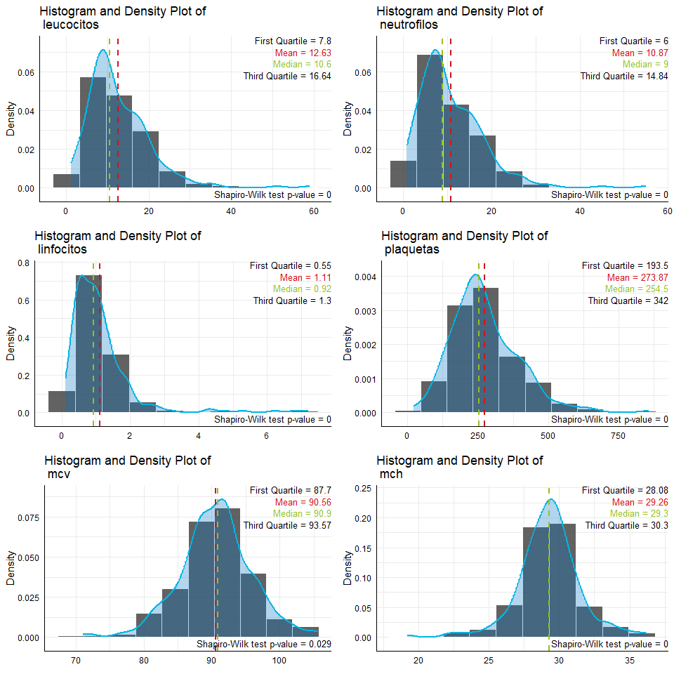

### Numerical variables in survivors and non-survivor

<div style="text-align: justify">

In this part, density plots will be used to illustrate the data grouped
by the outcome. Other plots will not be included in the analysis, as a
table with more detailed information will be presented. The questions we
will ask ourselves are: Does the data appear to be normally distributed?
and are the variances between groups equal?

</div>

``` r
# Selection of numerical variables of survivors
surv_numerical <- data |>
  dplyr::select(where(is.numeric), a_f) |>
  dplyr::filter(a_f == "Survivor")

# Selection of numerical variables of non-survivors
non_numerical <- data |>
  dplyr::select(where(is.numeric), a_f) |>
  dplyr::filter(a_f == "Non-survivor")
```

``` r
# Summary statistics of survivors
lapply(surv_numerical, function(x)
  summary(x))

# Summary statistics of non-survivors
lapply(non_numerical, function(x)
  summary(x))
```

``` r
# Exploration of age by group
p1 <- group_stat_table_plot(data, "edad", "a_f")

# Exploration of white-cells by group
p2 <- group_stat_table_plot(data, "leucocitos", "a_f")

# Exploration of neutrophils by group
p3 <- group_stat_table_plot(data, "neutrofilos", "a_f")

# Exploration of lymphocytes by group
p4 <- group_stat_table_plot(data, "linfocitos", "a_f")

p1 + p2 + p3 + p4 + plot_annotation(tag_levels = 'A')
```

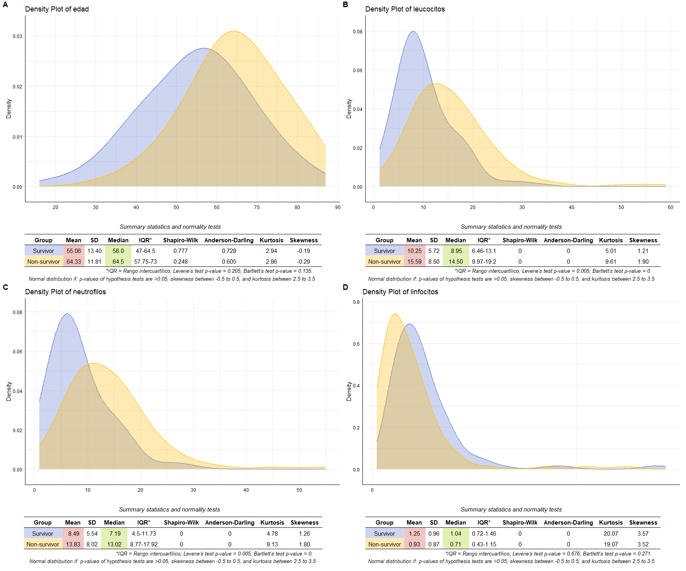

### Correlation matrix (multicollinearity)

<div style="text-align: justify">

The correlation between independent variables will be explored in order
to identify multicollinearity. The numeric variables are different, with
the exception of white-cells and the PaO<sub>2</sub>:FiO<sub>2</sub>
ratio. In the case of using white-cells and neutrophils or lymphocytes,
it’s possible that the information provided by white-cells may be
redundant and generate biased estimates. The same applies to the
PaO<sub>2</sub>:FiO<sub>2</sub> ratio and the FiO<sub>2</sub>. Given the
clinical relevance of the PaO₂:FiO₂ ratio, it is preferable to work with
this ratio rather than the PaO₂ alone.

</div>

> 📝***NOTE:*** ggplot objects can’t process markdown text

``` r
# Selection of numerical variables
data_num = data |>
  dplyr::select(where(is.numeric)) |>
  na.omit()

# Rename variables
cor_data = rename(
  data_num,
  "Age" = edad,
  "Respiratory rate (BPM)" = frecuencia_respiratoria,
  "Heart rate (BPM)" = frecuencia_cardiaca,
  "SBP" = p_a_sistolica,
  "DBP" = p_a_diastolica,
  "White-cells" = leucocitos,
  "Neutrophils" = neutrofilos,
  "Lymphocytes" = linfocitos,
  "Platelets" = plaquetas,
  "MCV" = mcv,
  "MCH" = mch,
  "Hemoglobin" = hemoglobina,
  "Hematocrit" = hematocrito,
  "Serum creatinine" = creatinina,
  "BUN" = urea,
  "Glucose" = glucosa,
  "pH" = ph,
  "Anion Gap" = anion_gap,
  "Sodium" = sodio,
  "Potasium" = potasio,
  "Chlorine" = cloro,
  "Calcium" = calcio,
  "SaO2" = saturacion_de_oxigeno,
  "FiO2" = fio2_aga,
  "PaO2:FiO2 ratio" = pafi,
  "PaO2" = po2,
  "PCO2" = pco2,
  "HCO3" = hco3,
  "Duration of disease" = t_de_enfermedad
)

# Correlation matrix
corr <- round(cor(cor_data), 1)

# Visualization
FS1 <- my_ggcorrplor(corr)

# View
FS1
```

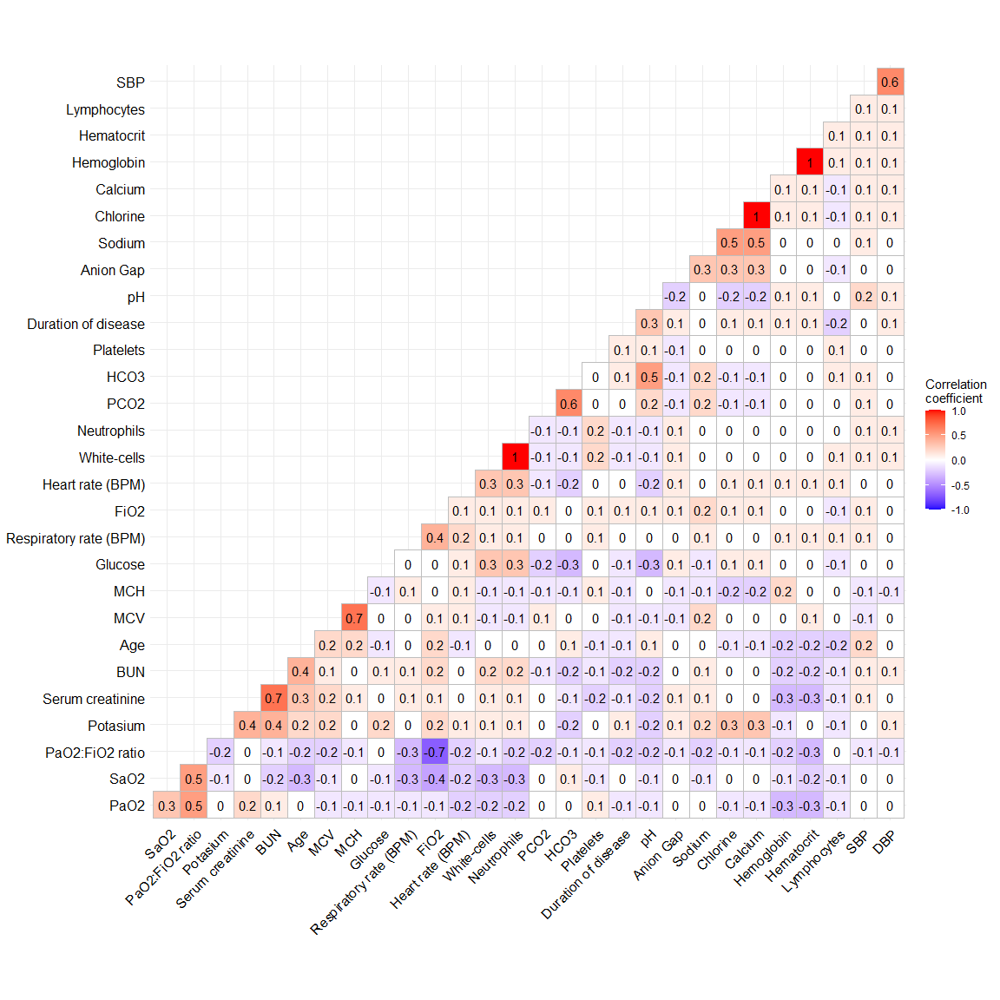

``` r
# Visualization
FS1_grey <- my_ggcorrplor_grey(corr)
```

# Produce outputs

## Table 1. Demographics and clinical characteristics of patients

``` r
# Demographics characteristics and history
table_1.1 <- data |>
  tbl_summary(
    include = c(edad:t_de_enfermedad, a_f),
    by = a_f,
    percent = "column",
    digits = list(all_continuous() ~ c(1, 1))) |>
  add_overall() |>
  add_p() |>
  bold_p(t = 0.05) |>
  modify_header(all_stat_cols() ~ "**{level}** (n = {n})",
                stat_0 = "**All patients** (n = {N})",
                p.value = "**p value**") |>
  modify_spanning_header(all_stat_cols(stat_0 = FALSE) ~ "**Mortality**") |>
  modify_caption("**Table 1**. Demographics and clinical characteristics of patients on admission")

# Signs and symptoms
table_1.2 <- data |>
  tbl_summary(
    include = c(fiebre:sensorio, a_f),
    by = a_f,
    percent = "column",
    digits = list(all_continuous() ~ c(1, 1))) |>
  modify_header(all_stat_cols() ~ "**{level}** (n = {n})") |>
  add_overall() |>
  add_p() |>
  bold_p(t = 0.05)

# Vital signs
table_1.3 <- data |>
  tbl_summary(
    include = c(frecuencia_respiratoria:p_a_diastolica.c, a_f),
    by = a_f,
    percent = "column",
    digits = list(all_continuous() ~ c(1, 1))) |>
  modify_header(all_stat_cols() ~ "**{level}** (n = {n})") |>
  add_overall() |>
  add_p() |>
  bold_p(t = 0.05)

# Stack tables
table_1 = tbl_stack(
  list(table_1.1, table_1.2, table_1.3),
  group_header = c(
    "Demographics characteristics and history",
    "Signs and symtoms",
    "Vital signs"),
  quiet = TRUE)

# Convert gtsummary object to a flextable object and format character columns
flex_table_1 <- table_1 |>
  gtsummary::as_flex_table() |>
  my_flextable_theme() |>
  flextable::fontsize(part = "all", size = 10) |>
  ftExtra::colformat_md()

# View (gtsummary object)
table_1
```

<div id="wcnzuleaid" style="padding-left:0px;padding-right:0px;padding-top:10px;padding-bottom:10px;overflow-x:auto;overflow-y:auto;width:auto;height:auto;">
<style>#wcnzuleaid table {
  font-family: system-ui, 'Segoe UI', Roboto, Helvetica, Arial, sans-serif, 'Apple Color Emoji', 'Segoe UI Emoji', 'Segoe UI Symbol', 'Noto Color Emoji';
  -webkit-font-smoothing: antialiased;
  -moz-osx-font-smoothing: grayscale;
}
&#10;#wcnzuleaid thead, #wcnzuleaid tbody, #wcnzuleaid tfoot, #wcnzuleaid tr, #wcnzuleaid td, #wcnzuleaid th {
  border-style: none;
}
&#10;#wcnzuleaid p {
  margin: 0;
  padding: 0;
}
&#10;#wcnzuleaid .gt_table {
  display: table;
  border-collapse: collapse;
  line-height: normal;
  margin-left: auto;
  margin-right: auto;
  color: #333333;
  font-size: 13px;
  font-weight: normal;
  font-style: normal;
  background-color: #FFFFFF;
  width: auto;
  border-top-style: solid;
  border-top-width: 2px;
  border-top-color: #A8A8A8;
  border-right-style: none;
  border-right-width: 2px;
  border-right-color: #D3D3D3;
  border-bottom-style: solid;
  border-bottom-width: 2px;
  border-bottom-color: #A8A8A8;
  border-left-style: none;
  border-left-width: 2px;
  border-left-color: #D3D3D3;
}
&#10;#wcnzuleaid .gt_caption {
  padding-top: 4px;
  padding-bottom: 4px;
}
&#10;#wcnzuleaid .gt_title {
  color: #333333;
  font-size: 125%;
  font-weight: initial;
  padding-top: 4px;
  padding-bottom: 4px;
  padding-left: 5px;
  padding-right: 5px;
  border-bottom-color: #FFFFFF;
  border-bottom-width: 0;
}
&#10;#wcnzuleaid .gt_subtitle {
  color: #333333;
  font-size: 85%;
  font-weight: initial;
  padding-top: 3px;
  padding-bottom: 5px;
  padding-left: 5px;
  padding-right: 5px;
  border-top-color: #FFFFFF;
  border-top-width: 0;
}
&#10;#wcnzuleaid .gt_heading {
  background-color: #FFFFFF;
  text-align: center;
  border-bottom-color: #FFFFFF;
  border-left-style: none;
  border-left-width: 1px;
  border-left-color: #D3D3D3;
  border-right-style: none;
  border-right-width: 1px;
  border-right-color: #D3D3D3;
}
&#10;#wcnzuleaid .gt_bottom_border {
  border-bottom-style: solid;
  border-bottom-width: 2px;
  border-bottom-color: #D3D3D3;
}
&#10;#wcnzuleaid .gt_col_headings {
  border-top-style: solid;
  border-top-width: 2px;
  border-top-color: #D3D3D3;
  border-bottom-style: solid;
  border-bottom-width: 2px;
  border-bottom-color: #D3D3D3;
  border-left-style: none;
  border-left-width: 1px;
  border-left-color: #D3D3D3;
  border-right-style: none;
  border-right-width: 1px;
  border-right-color: #D3D3D3;
}
&#10;#wcnzuleaid .gt_col_heading {
  color: #333333;
  background-color: #FFFFFF;
  font-size: 100%;
  font-weight: normal;
  text-transform: inherit;
  border-left-style: none;
  border-left-width: 1px;
  border-left-color: #D3D3D3;
  border-right-style: none;
  border-right-width: 1px;
  border-right-color: #D3D3D3;
  vertical-align: bottom;
  padding-top: 5px;
  padding-bottom: 6px;
  padding-left: 5px;
  padding-right: 5px;
  overflow-x: hidden;
}
&#10;#wcnzuleaid .gt_column_spanner_outer {
  color: #333333;
  background-color: #FFFFFF;
  font-size: 100%;
  font-weight: normal;
  text-transform: inherit;
  padding-top: 0;
  padding-bottom: 0;
  padding-left: 4px;
  padding-right: 4px;
}
&#10;#wcnzuleaid .gt_column_spanner_outer:first-child {
  padding-left: 0;
}
&#10;#wcnzuleaid .gt_column_spanner_outer:last-child {
  padding-right: 0;
}
&#10;#wcnzuleaid .gt_column_spanner {
  border-bottom-style: solid;
  border-bottom-width: 2px;
  border-bottom-color: #D3D3D3;
  vertical-align: bottom;
  padding-top: 5px;
  padding-bottom: 5px;
  overflow-x: hidden;
  display: inline-block;
  width: 100%;
}
&#10;#wcnzuleaid .gt_spanner_row {
  border-bottom-style: hidden;
}
&#10;#wcnzuleaid .gt_group_heading {
  padding-top: 1px;
  padding-bottom: 1px;
  padding-left: 5px;
  padding-right: 5px;
  color: #333333;
  background-color: #FFFFFF;
  font-size: 100%;
  font-weight: initial;
  text-transform: inherit;
  border-top-style: solid;
  border-top-width: 2px;
  border-top-color: #D3D3D3;
  border-bottom-style: solid;
  border-bottom-width: 2px;
  border-bottom-color: #D3D3D3;
  border-left-style: none;
  border-left-width: 1px;
  border-left-color: #D3D3D3;
  border-right-style: none;
  border-right-width: 1px;
  border-right-color: #D3D3D3;
  vertical-align: middle;
  text-align: left;
}
&#10;#wcnzuleaid .gt_empty_group_heading {
  padding: 0.5px;
  color: #333333;
  background-color: #FFFFFF;
  font-size: 100%;
  font-weight: initial;
  border-top-style: solid;
  border-top-width: 2px;
  border-top-color: #D3D3D3;
  border-bottom-style: solid;
  border-bottom-width: 2px;
  border-bottom-color: #D3D3D3;
  vertical-align: middle;
}
&#10;#wcnzuleaid .gt_from_md > :first-child {
  margin-top: 0;
}
&#10;#wcnzuleaid .gt_from_md > :last-child {
  margin-bottom: 0;
}
&#10;#wcnzuleaid .gt_row {
  padding-top: 1px;
  padding-bottom: 1px;
  padding-left: 5px;
  padding-right: 5px;
  margin: 10px;
  border-top-style: solid;
  border-top-width: 1px;
  border-top-color: #D3D3D3;
  border-left-style: none;
  border-left-width: 1px;
  border-left-color: #D3D3D3;
  border-right-style: none;
  border-right-width: 1px;
  border-right-color: #D3D3D3;
  vertical-align: middle;
  overflow-x: hidden;
}
&#10;#wcnzuleaid .gt_stub {
  color: #333333;
  background-color: #FFFFFF;
  font-size: 100%;
  font-weight: initial;
  text-transform: inherit;
  border-right-style: solid;
  border-right-width: 2px;
  border-right-color: #D3D3D3;
  padding-left: 5px;
  padding-right: 5px;
}
&#10;#wcnzuleaid .gt_stub_row_group {
  color: #333333;
  background-color: #FFFFFF;
  font-size: 100%;
  font-weight: initial;
  text-transform: inherit;
  border-right-style: solid;
  border-right-width: 2px;
  border-right-color: #D3D3D3;
  padding-left: 5px;
  padding-right: 5px;
  vertical-align: top;
}
&#10;#wcnzuleaid .gt_row_group_first td {
  border-top-width: 2px;
}
&#10;#wcnzuleaid .gt_row_group_first th {
  border-top-width: 2px;
}
&#10;#wcnzuleaid .gt_summary_row {
  color: #333333;
  background-color: #FFFFFF;
  text-transform: inherit;
  padding-top: 1px;
  padding-bottom: 1px;
  padding-left: 5px;
  padding-right: 5px;
}
&#10;#wcnzuleaid .gt_first_summary_row {
  border-top-style: solid;
  border-top-color: #D3D3D3;
}
&#10;#wcnzuleaid .gt_first_summary_row.thick {
  border-top-width: 2px;
}
&#10;#wcnzuleaid .gt_last_summary_row {
  padding-top: 1px;
  padding-bottom: 1px;
  padding-left: 5px;
  padding-right: 5px;
  border-bottom-style: solid;
  border-bottom-width: 2px;
  border-bottom-color: #D3D3D3;
}
&#10;#wcnzuleaid .gt_grand_summary_row {
  color: #333333;
  background-color: #FFFFFF;
  text-transform: inherit;
  padding-top: 1px;
  padding-bottom: 1px;
  padding-left: 5px;
  padding-right: 5px;
}
&#10;#wcnzuleaid .gt_first_grand_summary_row {
  padding-top: 1px;
  padding-bottom: 1px;
  padding-left: 5px;
  padding-right: 5px;
  border-top-style: double;
  border-top-width: 6px;
  border-top-color: #D3D3D3;
}
&#10;#wcnzuleaid .gt_last_grand_summary_row_top {
  padding-top: 1px;
  padding-bottom: 1px;
  padding-left: 5px;
  padding-right: 5px;
  border-bottom-style: double;
  border-bottom-width: 6px;
  border-bottom-color: #D3D3D3;
}
&#10;#wcnzuleaid .gt_striped {
  background-color: rgba(128, 128, 128, 0.05);
}
&#10;#wcnzuleaid .gt_table_body {
  border-top-style: solid;
  border-top-width: 2px;
  border-top-color: #D3D3D3;
  border-bottom-style: solid;
  border-bottom-width: 2px;
  border-bottom-color: #D3D3D3;
}
&#10;#wcnzuleaid .gt_footnotes {
  color: #333333;
  background-color: #FFFFFF;
  border-bottom-style: none;
  border-bottom-width: 2px;
  border-bottom-color: #D3D3D3;
  border-left-style: none;
  border-left-width: 2px;
  border-left-color: #D3D3D3;
  border-right-style: none;
  border-right-width: 2px;
  border-right-color: #D3D3D3;
}
&#10;#wcnzuleaid .gt_footnote {
  margin: 0px;
  font-size: 90%;
  padding-top: 1px;
  padding-bottom: 1px;
  padding-left: 5px;
  padding-right: 5px;
}
&#10;#wcnzuleaid .gt_sourcenotes {
  color: #333333;
  background-color: #FFFFFF;
  border-bottom-style: none;
  border-bottom-width: 2px;
  border-bottom-color: #D3D3D3;
  border-left-style: none;
  border-left-width: 2px;
  border-left-color: #D3D3D3;
  border-right-style: none;
  border-right-width: 2px;
  border-right-color: #D3D3D3;
}
&#10;#wcnzuleaid .gt_sourcenote {
  font-size: 90%;
  padding-top: 1px;
  padding-bottom: 1px;
  padding-left: 5px;
  padding-right: 5px;
}
&#10;#wcnzuleaid .gt_left {
  text-align: left;
}
&#10;#wcnzuleaid .gt_center {
  text-align: center;
}
&#10;#wcnzuleaid .gt_right {
  text-align: right;
  font-variant-numeric: tabular-nums;
}
&#10;#wcnzuleaid .gt_font_normal {
  font-weight: normal;
}
&#10;#wcnzuleaid .gt_font_bold {
  font-weight: bold;
}
&#10;#wcnzuleaid .gt_font_italic {
  font-style: italic;
}
&#10;#wcnzuleaid .gt_super {
  font-size: 65%;
}
&#10;#wcnzuleaid .gt_footnote_marks {
  font-size: 75%;
  vertical-align: 0.4em;
  position: initial;
}
&#10;#wcnzuleaid .gt_asterisk {
  font-size: 100%;
  vertical-align: 0;
}
&#10;#wcnzuleaid .gt_indent_1 {
  text-indent: 5px;
}
&#10;#wcnzuleaid .gt_indent_2 {
  text-indent: 10px;
}
&#10;#wcnzuleaid .gt_indent_3 {
  text-indent: 15px;
}
&#10;#wcnzuleaid .gt_indent_4 {
  text-indent: 20px;
}
&#10;#wcnzuleaid .gt_indent_5 {
  text-indent: 25px;
}
</style>
<table class="gt_table" data-quarto-disable-processing="false" data-quarto-bootstrap="false">
  <caption><strong>Table 1</strong>. Demographics and clinical characteristics of patients on admission</caption>
  <thead>
    &#10;    <tr class="gt_col_headings gt_spanner_row">
      <th class="gt_col_heading gt_columns_bottom_border gt_left" rowspan="2" colspan="1" scope="col" id="&lt;strong&gt;Characteristic&lt;/strong&gt;"><strong>Characteristic</strong></th>
      <th class="gt_col_heading gt_columns_bottom_border gt_center" rowspan="2" colspan="1" scope="col" id="&lt;strong&gt;All patients&lt;/strong&gt; (n = 287)&lt;span class=&quot;gt_footnote_marks&quot; style=&quot;white-space:nowrap;font-style:italic;font-weight:normal;&quot;&gt;&lt;sup&gt;1&lt;/sup&gt;&lt;/span&gt;"><strong>All patients</strong> (n = 287)<span class="gt_footnote_marks" style="white-space:nowrap;font-style:italic;font-weight:normal;"><sup>1</sup></span></th>
      <th class="gt_center gt_columns_top_border gt_column_spanner_outer" rowspan="1" colspan="2" scope="colgroup" id="&lt;strong&gt;Mortality&lt;/strong&gt;">
        <span class="gt_column_spanner"><strong>Mortality</strong></span>
      </th>
      <th class="gt_col_heading gt_columns_bottom_border gt_center" rowspan="2" colspan="1" scope="col" id="&lt;strong&gt;p value&lt;/strong&gt;&lt;span class=&quot;gt_footnote_marks&quot; style=&quot;white-space:nowrap;font-style:italic;font-weight:normal;&quot;&gt;&lt;sup&gt;2&lt;/sup&gt;&lt;/span&gt;"><strong>p value</strong><span class="gt_footnote_marks" style="white-space:nowrap;font-style:italic;font-weight:normal;"><sup>2</sup></span></th>
    </tr>
    <tr class="gt_col_headings">
      <th class="gt_col_heading gt_columns_bottom_border gt_center" rowspan="1" colspan="1" scope="col" id="&lt;strong&gt;Survivor&lt;/strong&gt; (n = 155)&lt;span class=&quot;gt_footnote_marks&quot; style=&quot;white-space:nowrap;font-style:italic;font-weight:normal;&quot;&gt;&lt;sup&gt;1&lt;/sup&gt;&lt;/span&gt;"><strong>Survivor</strong> (n = 155)<span class="gt_footnote_marks" style="white-space:nowrap;font-style:italic;font-weight:normal;"><sup>1</sup></span></th>
      <th class="gt_col_heading gt_columns_bottom_border gt_center" rowspan="1" colspan="1" scope="col" id="&lt;strong&gt;Non-survivor&lt;/strong&gt; (n = 132)&lt;span class=&quot;gt_footnote_marks&quot; style=&quot;white-space:nowrap;font-style:italic;font-weight:normal;&quot;&gt;&lt;sup&gt;1&lt;/sup&gt;&lt;/span&gt;"><strong>Non-survivor</strong> (n = 132)<span class="gt_footnote_marks" style="white-space:nowrap;font-style:italic;font-weight:normal;"><sup>1</sup></span></th>
    </tr>
  </thead>
  <tbody class="gt_table_body">
    <tr class="gt_group_heading_row">
      <th colspan="5" class="gt_group_heading" scope="colgroup" id="Demographics characteristics and history">Demographics characteristics and history</th>
    </tr>
    <tr class="gt_row_group_first"><td headers="Demographics characteristics and history  label" class="gt_row gt_left">Age (years)</td>
<td headers="Demographics characteristics and history  stat_0" class="gt_row gt_center">60.0 (51.0, 68.0)</td>
<td headers="Demographics characteristics and history  stat_1" class="gt_row gt_center">56.0 (47.0, 64.5)</td>
<td headers="Demographics characteristics and history  stat_2" class="gt_row gt_center">64.5 (57.8, 73.0)</td>
<td headers="Demographics characteristics and history  p.value" class="gt_row gt_center" style="font-weight: bold;"><0.001</td></tr>
    <tr><td headers="Demographics characteristics and history  label" class="gt_row gt_left">Age (years)</td>
<td headers="Demographics characteristics and history  stat_0" class="gt_row gt_center"><br /></td>
<td headers="Demographics characteristics and history  stat_1" class="gt_row gt_center"><br /></td>
<td headers="Demographics characteristics and history  stat_2" class="gt_row gt_center"><br /></td>
<td headers="Demographics characteristics and history  p.value" class="gt_row gt_center" style="font-weight: bold;"><0.001</td></tr>
    <tr><td headers="Demographics characteristics and history  label" class="gt_row gt_left">    &lt; 61</td>
<td headers="Demographics characteristics and history  stat_0" class="gt_row gt_center">149 (51.9%)</td>
<td headers="Demographics characteristics and history  stat_1" class="gt_row gt_center">102 (65.8%)</td>
<td headers="Demographics characteristics and history  stat_2" class="gt_row gt_center">47 (35.6%)</td>
<td headers="Demographics characteristics and history  p.value" class="gt_row gt_center"><br /></td></tr>
    <tr><td headers="Demographics characteristics and history  label" class="gt_row gt_left">    &gt;= 61</td>
<td headers="Demographics characteristics and history  stat_0" class="gt_row gt_center">138 (48.1%)</td>
<td headers="Demographics characteristics and history  stat_1" class="gt_row gt_center">53 (34.2%)</td>
<td headers="Demographics characteristics and history  stat_2" class="gt_row gt_center">85 (64.4%)</td>
<td headers="Demographics characteristics and history  p.value" class="gt_row gt_center"><br /></td></tr>
    <tr><td headers="Demographics characteristics and history  label" class="gt_row gt_left">Sex</td>
<td headers="Demographics characteristics and history  stat_0" class="gt_row gt_center"><br /></td>
<td headers="Demographics characteristics and history  stat_1" class="gt_row gt_center"><br /></td>
<td headers="Demographics characteristics and history  stat_2" class="gt_row gt_center"><br /></td>
<td headers="Demographics characteristics and history  p.value" class="gt_row gt_center">0.46</td></tr>
    <tr><td headers="Demographics characteristics and history  label" class="gt_row gt_left">    Female</td>
<td headers="Demographics characteristics and history  stat_0" class="gt_row gt_center">98 (34.1%)</td>
<td headers="Demographics characteristics and history  stat_1" class="gt_row gt_center">50 (32.3%)</td>
<td headers="Demographics characteristics and history  stat_2" class="gt_row gt_center">48 (36.4%)</td>
<td headers="Demographics characteristics and history  p.value" class="gt_row gt_center"><br /></td></tr>
    <tr><td headers="Demographics characteristics and history  label" class="gt_row gt_left">    Male</td>
<td headers="Demographics characteristics and history  stat_0" class="gt_row gt_center">189 (65.9%)</td>
<td headers="Demographics characteristics and history  stat_1" class="gt_row gt_center">105 (67.7%)</td>
<td headers="Demographics characteristics and history  stat_2" class="gt_row gt_center">84 (63.6%)</td>
<td headers="Demographics characteristics and history  p.value" class="gt_row gt_center"><br /></td></tr>
    <tr><td headers="Demographics characteristics and history  label" class="gt_row gt_left">Smoking</td>
<td headers="Demographics characteristics and history  stat_0" class="gt_row gt_center">2 (0.7%)</td>
<td headers="Demographics characteristics and history  stat_1" class="gt_row gt_center">1 (0.6%)</td>
<td headers="Demographics characteristics and history  stat_2" class="gt_row gt_center">1 (0.8%)</td>
<td headers="Demographics characteristics and history  p.value" class="gt_row gt_center">>0.99</td></tr>
    <tr><td headers="Demographics characteristics and history  label" class="gt_row gt_left">Alcoholism</td>
<td headers="Demographics characteristics and history  stat_0" class="gt_row gt_center">2 (0.7%)</td>
<td headers="Demographics characteristics and history  stat_1" class="gt_row gt_center">1 (0.6%)</td>
<td headers="Demographics characteristics and history  stat_2" class="gt_row gt_center">1 (0.8%)</td>
<td headers="Demographics characteristics and history  p.value" class="gt_row gt_center">>0.99</td></tr>
    <tr><td headers="Demographics characteristics and history  label" class="gt_row gt_left">Dyslipidemia</td>
<td headers="Demographics characteristics and history  stat_0" class="gt_row gt_center">4 (1.4%)</td>
<td headers="Demographics characteristics and history  stat_1" class="gt_row gt_center">3 (1.9%)</td>
<td headers="Demographics characteristics and history  stat_2" class="gt_row gt_center">1 (0.8%)</td>
<td headers="Demographics characteristics and history  p.value" class="gt_row gt_center">0.63</td></tr>
    <tr><td headers="Demographics characteristics and history  label" class="gt_row gt_left">Obesity</td>
<td headers="Demographics characteristics and history  stat_0" class="gt_row gt_center">44 (15.3%)</td>
<td headers="Demographics characteristics and history  stat_1" class="gt_row gt_center">29 (18.7%)</td>
<td headers="Demographics characteristics and history  stat_2" class="gt_row gt_center">15 (11.4%)</td>
<td headers="Demographics characteristics and history  p.value" class="gt_row gt_center">0.085</td></tr>
    <tr><td headers="Demographics characteristics and history  label" class="gt_row gt_left">Hypertension</td>
<td headers="Demographics characteristics and history  stat_0" class="gt_row gt_center">102 (35.5%)</td>
<td headers="Demographics characteristics and history  stat_1" class="gt_row gt_center">43 (27.7%)</td>
<td headers="Demographics characteristics and history  stat_2" class="gt_row gt_center">59 (44.7%)</td>
<td headers="Demographics characteristics and history  p.value" class="gt_row gt_center" style="font-weight: bold;">0.003</td></tr>
    <tr><td headers="Demographics characteristics and history  label" class="gt_row gt_left">Cerebrovascular disease</td>
<td headers="Demographics characteristics and history  stat_0" class="gt_row gt_center">4 (1.4%)</td>
<td headers="Demographics characteristics and history  stat_1" class="gt_row gt_center">0 (0.0%)</td>
<td headers="Demographics characteristics and history  stat_2" class="gt_row gt_center">4 (3.0%)</td>
<td headers="Demographics characteristics and history  p.value" class="gt_row gt_center" style="font-weight: bold;">0.044</td></tr>
    <tr><td headers="Demographics characteristics and history  label" class="gt_row gt_left">Cancer</td>
<td headers="Demographics characteristics and history  stat_0" class="gt_row gt_center">1 (0.3%)</td>
<td headers="Demographics characteristics and history  stat_1" class="gt_row gt_center">0 (0.0%)</td>
<td headers="Demographics characteristics and history  stat_2" class="gt_row gt_center">1 (0.8%)</td>
<td headers="Demographics characteristics and history  p.value" class="gt_row gt_center">0.46</td></tr>
    <tr><td headers="Demographics characteristics and history  label" class="gt_row gt_left">HIV</td>
<td headers="Demographics characteristics and history  stat_0" class="gt_row gt_center">1 (0.3%)</td>
<td headers="Demographics characteristics and history  stat_1" class="gt_row gt_center">0 (0.0%)</td>
<td headers="Demographics characteristics and history  stat_2" class="gt_row gt_center">1 (0.8%)</td>
<td headers="Demographics characteristics and history  p.value" class="gt_row gt_center">0.46</td></tr>
    <tr><td headers="Demographics characteristics and history  label" class="gt_row gt_left">Immunesupressive disease</td>
<td headers="Demographics characteristics and history  stat_0" class="gt_row gt_center">3 (1.0%)</td>
<td headers="Demographics characteristics and history  stat_1" class="gt_row gt_center">1 (0.6%)</td>
<td headers="Demographics characteristics and history  stat_2" class="gt_row gt_center">2 (1.5%)</td>
<td headers="Demographics characteristics and history  p.value" class="gt_row gt_center">0.60</td></tr>
    <tr><td headers="Demographics characteristics and history  label" class="gt_row gt_left">Chronic renal disease</td>
<td headers="Demographics characteristics and history  stat_0" class="gt_row gt_center">10 (3.5%)</td>
<td headers="Demographics characteristics and history  stat_1" class="gt_row gt_center">5 (3.2%)</td>
<td headers="Demographics characteristics and history  stat_2" class="gt_row gt_center">5 (3.8%)</td>
<td headers="Demographics characteristics and history  p.value" class="gt_row gt_center">>0.99</td></tr>
    <tr><td headers="Demographics characteristics and history  label" class="gt_row gt_left">Hemodialysis</td>
<td headers="Demographics characteristics and history  stat_0" class="gt_row gt_center">5 (1.9%)</td>
<td headers="Demographics characteristics and history  stat_1" class="gt_row gt_center">1 (0.8%)</td>
<td headers="Demographics characteristics and history  stat_2" class="gt_row gt_center">4 (3.0%)</td>
<td headers="Demographics characteristics and history  p.value" class="gt_row gt_center">0.37</td></tr>
    <tr><td headers="Demographics characteristics and history  label" class="gt_row gt_left">Asthma</td>
<td headers="Demographics characteristics and history  stat_0" class="gt_row gt_center">6 (2.1%)</td>
<td headers="Demographics characteristics and history  stat_1" class="gt_row gt_center">4 (2.6%)</td>
<td headers="Demographics characteristics and history  stat_2" class="gt_row gt_center">2 (1.5%)</td>
<td headers="Demographics characteristics and history  p.value" class="gt_row gt_center">0.69</td></tr>
    <tr><td headers="Demographics characteristics and history  label" class="gt_row gt_left">Duration of disease (days)</td>
<td headers="Demographics characteristics and history  stat_0" class="gt_row gt_center">7.0 (5.0, 10.0)</td>
<td headers="Demographics characteristics and history  stat_1" class="gt_row gt_center">7.0 (5.0, 10.0)</td>
<td headers="Demographics characteristics and history  stat_2" class="gt_row gt_center">7.0 (5.0, 10.0)</td>
<td headers="Demographics characteristics and history  p.value" class="gt_row gt_center">0.23</td></tr>
    <tr class="gt_group_heading_row">
      <th colspan="5" class="gt_group_heading" scope="colgroup" id="Signs and symtoms">Signs and symtoms</th>
    </tr>
    <tr class="gt_row_group_first"><td headers="Signs and symtoms  label" class="gt_row gt_left">Fever</td>
<td headers="Signs and symtoms  stat_0" class="gt_row gt_center">170 (59.2%)</td>
<td headers="Signs and symtoms  stat_1" class="gt_row gt_center">82 (52.9%)</td>
<td headers="Signs and symtoms  stat_2" class="gt_row gt_center">88 (66.7%)</td>
<td headers="Signs and symtoms  p.value" class="gt_row gt_center" style="font-weight: bold;">0.018</td></tr>
    <tr><td headers="Signs and symtoms  label" class="gt_row gt_left">Dry cought</td>
<td headers="Signs and symtoms  stat_0" class="gt_row gt_center">218 (76.0%)</td>
<td headers="Signs and symtoms  stat_1" class="gt_row gt_center">113 (72.9%)</td>
<td headers="Signs and symtoms  stat_2" class="gt_row gt_center">105 (79.5%)</td>
<td headers="Signs and symtoms  p.value" class="gt_row gt_center">0.19</td></tr>
    <tr><td headers="Signs and symtoms  label" class="gt_row gt_left">Sore throat</td>
<td headers="Signs and symtoms  stat_0" class="gt_row gt_center">92 (32.1%)</td>
<td headers="Signs and symtoms  stat_1" class="gt_row gt_center">59 (38.1%)</td>
<td headers="Signs and symtoms  stat_2" class="gt_row gt_center">33 (25.0%)</td>
<td headers="Signs and symtoms  p.value" class="gt_row gt_center" style="font-weight: bold;">0.018</td></tr>
    <tr><td headers="Signs and symtoms  label" class="gt_row gt_left">General malaise</td>
<td headers="Signs and symtoms  stat_0" class="gt_row gt_center">206 (71.8%)</td>
<td headers="Signs and symtoms  stat_1" class="gt_row gt_center">115 (74.2%)</td>
<td headers="Signs and symtoms  stat_2" class="gt_row gt_center">91 (68.9%)</td>
<td headers="Signs and symtoms  p.value" class="gt_row gt_center">0.32</td></tr>
    <tr><td headers="Signs and symtoms  label" class="gt_row gt_left">Headache</td>
<td headers="Signs and symtoms  stat_0" class="gt_row gt_center">62 (21.6%)</td>
<td headers="Signs and symtoms  stat_1" class="gt_row gt_center">49 (31.6%)</td>
<td headers="Signs and symtoms  stat_2" class="gt_row gt_center">13 (9.8%)</td>
<td headers="Signs and symtoms  p.value" class="gt_row gt_center" style="font-weight: bold;"><0.001</td></tr>
    <tr><td headers="Signs and symtoms  label" class="gt_row gt_left">Tachypnea</td>
<td headers="Signs and symtoms  stat_0" class="gt_row gt_center">99 (34.5%)</td>
<td headers="Signs and symtoms  stat_1" class="gt_row gt_center">65 (41.9%)</td>
<td headers="Signs and symtoms  stat_2" class="gt_row gt_center">34 (25.8%)</td>
<td headers="Signs and symtoms  p.value" class="gt_row gt_center" style="font-weight: bold;">0.004</td></tr>
    <tr><td headers="Signs and symtoms  label" class="gt_row gt_left">Dyspnea</td>
<td headers="Signs and symtoms  stat_0" class="gt_row gt_center">242 (84.3%)</td>
<td headers="Signs and symtoms  stat_1" class="gt_row gt_center">120 (77.4%)</td>
<td headers="Signs and symtoms  stat_2" class="gt_row gt_center">122 (92.4%)</td>
<td headers="Signs and symtoms  p.value" class="gt_row gt_center" style="font-weight: bold;"><0.001</td></tr>
    <tr><td headers="Signs and symtoms  label" class="gt_row gt_left">Anosmia</td>
<td headers="Signs and symtoms  stat_0" class="gt_row gt_center">16 (5.6%)</td>
<td headers="Signs and symtoms  stat_1" class="gt_row gt_center">11 (7.1%)</td>
<td headers="Signs and symtoms  stat_2" class="gt_row gt_center">5 (3.8%)</td>
<td headers="Signs and symtoms  p.value" class="gt_row gt_center">0.22</td></tr>
    <tr><td headers="Signs and symtoms  label" class="gt_row gt_left">Dysgeusia</td>
<td headers="Signs and symtoms  stat_0" class="gt_row gt_center">13 (4.5%)</td>
<td headers="Signs and symtoms  stat_1" class="gt_row gt_center">8 (5.2%)</td>
<td headers="Signs and symtoms  stat_2" class="gt_row gt_center">5 (3.8%)</td>
<td headers="Signs and symtoms  p.value" class="gt_row gt_center">0.58</td></tr>
    <tr><td headers="Signs and symtoms  label" class="gt_row gt_left">Lung crackles</td>
<td headers="Signs and symtoms  stat_0" class="gt_row gt_center">141 (49.1%)</td>
<td headers="Signs and symtoms  stat_1" class="gt_row gt_center">91 (58.7%)</td>
<td headers="Signs and symtoms  stat_2" class="gt_row gt_center">50 (37.9%)</td>
<td headers="Signs and symtoms  p.value" class="gt_row gt_center" style="font-weight: bold;"><0.001</td></tr>
    <tr><td headers="Signs and symtoms  label" class="gt_row gt_left">Diarrhea</td>
<td headers="Signs and symtoms  stat_0" class="gt_row gt_center">18 (6.3%)</td>
<td headers="Signs and symtoms  stat_1" class="gt_row gt_center">8 (5.2%)</td>
<td headers="Signs and symtoms  stat_2" class="gt_row gt_center">10 (7.6%)</td>
<td headers="Signs and symtoms  p.value" class="gt_row gt_center">0.40</td></tr>
    <tr><td headers="Signs and symtoms  label" class="gt_row gt_left">Vomiting</td>
<td headers="Signs and symtoms  stat_0" class="gt_row gt_center">17 (5.9%)</td>
<td headers="Signs and symtoms  stat_1" class="gt_row gt_center">6 (3.9%)</td>
<td headers="Signs and symtoms  stat_2" class="gt_row gt_center">11 (8.3%)</td>
<td headers="Signs and symtoms  p.value" class="gt_row gt_center">0.11</td></tr>
    <tr><td headers="Signs and symtoms  label" class="gt_row gt_left">Asthenia</td>
<td headers="Signs and symtoms  stat_0" class="gt_row gt_center">48 (16.7%)</td>
<td headers="Signs and symtoms  stat_1" class="gt_row gt_center">34 (21.9%)</td>
<td headers="Signs and symtoms  stat_2" class="gt_row gt_center">14 (10.6%)</td>
<td headers="Signs and symtoms  p.value" class="gt_row gt_center" style="font-weight: bold;">0.010</td></tr>
    <tr><td headers="Signs and symtoms  label" class="gt_row gt_left">Abdominal pain</td>
<td headers="Signs and symtoms  stat_0" class="gt_row gt_center">12 (4.2%)</td>
<td headers="Signs and symtoms  stat_1" class="gt_row gt_center">8 (5.2%)</td>
<td headers="Signs and symtoms  stat_2" class="gt_row gt_center">4 (3.0%)</td>
<td headers="Signs and symtoms  p.value" class="gt_row gt_center">0.37</td></tr>
    <tr><td headers="Signs and symtoms  label" class="gt_row gt_left">Weight loss</td>
<td headers="Signs and symtoms  stat_0" class="gt_row gt_center">3 (1.0%)</td>
<td headers="Signs and symtoms  stat_1" class="gt_row gt_center">3 (1.9%)</td>
<td headers="Signs and symtoms  stat_2" class="gt_row gt_center">0 (0.0%)</td>
<td headers="Signs and symtoms  p.value" class="gt_row gt_center">0.25</td></tr>
    <tr><td headers="Signs and symtoms  label" class="gt_row gt_left">Polyuria</td>
<td headers="Signs and symtoms  stat_0" class="gt_row gt_center">12 (4.2%)</td>
<td headers="Signs and symtoms  stat_1" class="gt_row gt_center">9 (5.8%)</td>
<td headers="Signs and symtoms  stat_2" class="gt_row gt_center">3 (2.3%)</td>
<td headers="Signs and symtoms  p.value" class="gt_row gt_center">0.14</td></tr>
    <tr><td headers="Signs and symtoms  label" class="gt_row gt_left">Polidipsia</td>
<td headers="Signs and symtoms  stat_0" class="gt_row gt_center">10 (3.5%)</td>
<td headers="Signs and symtoms  stat_1" class="gt_row gt_center">8 (5.2%)</td>
<td headers="Signs and symtoms  stat_2" class="gt_row gt_center">2 (1.5%)</td>
<td headers="Signs and symtoms  p.value" class="gt_row gt_center">0.11</td></tr>
    <tr><td headers="Signs and symtoms  label" class="gt_row gt_left">Poliphagia</td>
<td headers="Signs and symtoms  stat_0" class="gt_row gt_center">5 (1.7%)</td>
<td headers="Signs and symtoms  stat_1" class="gt_row gt_center">4 (2.6%)</td>
<td headers="Signs and symtoms  stat_2" class="gt_row gt_center">1 (0.8%)</td>
<td headers="Signs and symtoms  p.value" class="gt_row gt_center">0.38</td></tr>
    <tr><td headers="Signs and symtoms  label" class="gt_row gt_left">Sensory</td>
<td headers="Signs and symtoms  stat_0" class="gt_row gt_center"><br /></td>
<td headers="Signs and symtoms  stat_1" class="gt_row gt_center"><br /></td>
<td headers="Signs and symtoms  stat_2" class="gt_row gt_center"><br /></td>
<td headers="Signs and symtoms  p.value" class="gt_row gt_center" style="font-weight: bold;"><0.001</td></tr>
    <tr><td headers="Signs and symtoms  label" class="gt_row gt_left">    Awake</td>
<td headers="Signs and symtoms  stat_0" class="gt_row gt_center">250 (91.2%)</td>
<td headers="Signs and symtoms  stat_1" class="gt_row gt_center">151 (97.4%)</td>
<td headers="Signs and symtoms  stat_2" class="gt_row gt_center">99 (83.2%)</td>
<td headers="Signs and symtoms  p.value" class="gt_row gt_center"><br /></td></tr>
    <tr><td headers="Signs and symtoms  label" class="gt_row gt_left">    Sleepy</td>
<td headers="Signs and symtoms  stat_0" class="gt_row gt_center">17 (6.2%)</td>
<td headers="Signs and symtoms  stat_1" class="gt_row gt_center">3 (1.9%)</td>
<td headers="Signs and symtoms  stat_2" class="gt_row gt_center">14 (11.8%)</td>
<td headers="Signs and symtoms  p.value" class="gt_row gt_center"><br /></td></tr>
    <tr><td headers="Signs and symtoms  label" class="gt_row gt_left">    Drowsy</td>
<td headers="Signs and symtoms  stat_0" class="gt_row gt_center">7 (2.6%)</td>
<td headers="Signs and symtoms  stat_1" class="gt_row gt_center">1 (0.6%)</td>
<td headers="Signs and symtoms  stat_2" class="gt_row gt_center">6 (5.0%)</td>
<td headers="Signs and symtoms  p.value" class="gt_row gt_center"><br /></td></tr>
    <tr class="gt_group_heading_row">
      <th colspan="5" class="gt_group_heading" scope="colgroup" id="Vital signs">Vital signs</th>
    </tr>
    <tr class="gt_row_group_first"><td headers="Vital signs  label" class="gt_row gt_left">Respiratory rate (BPM)</td>
<td headers="Vital signs  stat_0" class="gt_row gt_center">26.0 (23.0, 30.0)</td>
<td headers="Vital signs  stat_1" class="gt_row gt_center">26.0 (22.3, 28.0)</td>
<td headers="Vital signs  stat_2" class="gt_row gt_center">28.0 (24.0, 32.0)</td>
<td headers="Vital signs  p.value" class="gt_row gt_center" style="font-weight: bold;"><0.001</td></tr>
    <tr><td headers="Vital signs  label" class="gt_row gt_left">Respiratory rate (BPM)</td>
<td headers="Vital signs  stat_0" class="gt_row gt_center"><br /></td>
<td headers="Vital signs  stat_1" class="gt_row gt_center"><br /></td>
<td headers="Vital signs  stat_2" class="gt_row gt_center"><br /></td>
<td headers="Vital signs  p.value" class="gt_row gt_center" style="font-weight: bold;">0.006</td></tr>
    <tr><td headers="Vital signs  label" class="gt_row gt_left">    24 - 30</td>
<td headers="Vital signs  stat_0" class="gt_row gt_center">138 (51.7%)</td>
<td headers="Vital signs  stat_1" class="gt_row gt_center">76 (52.1%)</td>
<td headers="Vital signs  stat_2" class="gt_row gt_center">62 (51.2%)</td>
<td headers="Vital signs  p.value" class="gt_row gt_center"><br /></td></tr>
    <tr><td headers="Vital signs  label" class="gt_row gt_left">    &lt; 24</td>
<td headers="Vital signs  stat_0" class="gt_row gt_center">70 (26.2%)</td>
<td headers="Vital signs  stat_1" class="gt_row gt_center">47 (32.2%)</td>
<td headers="Vital signs  stat_2" class="gt_row gt_center">23 (19.0%)</td>
<td headers="Vital signs  p.value" class="gt_row gt_center"><br /></td></tr>
    <tr><td headers="Vital signs  label" class="gt_row gt_left">    &gt; 30</td>
<td headers="Vital signs  stat_0" class="gt_row gt_center">59 (22.1%)</td>
<td headers="Vital signs  stat_1" class="gt_row gt_center">23 (15.8%)</td>
<td headers="Vital signs  stat_2" class="gt_row gt_center">36 (29.8%)</td>
<td headers="Vital signs  p.value" class="gt_row gt_center"><br /></td></tr>
    <tr><td headers="Vital signs  label" class="gt_row gt_left">Heart rate (BPM)</td>
<td headers="Vital signs  stat_0" class="gt_row gt_center">100.0 (85.8, 113.0)</td>
<td headers="Vital signs  stat_1" class="gt_row gt_center">98.0 (82.3, 107.8)</td>
<td headers="Vital signs  stat_2" class="gt_row gt_center">105.5 (92.0, 115.8)</td>
<td headers="Vital signs  p.value" class="gt_row gt_center" style="font-weight: bold;"><0.001</td></tr>
    <tr><td headers="Vital signs  label" class="gt_row gt_left">Heart rate (BPM)</td>
<td headers="Vital signs  stat_0" class="gt_row gt_center"><br /></td>
<td headers="Vital signs  stat_1" class="gt_row gt_center"><br /></td>
<td headers="Vital signs  stat_2" class="gt_row gt_center"><br /></td>
<td headers="Vital signs  p.value" class="gt_row gt_center" style="font-weight: bold;"><0.001</td></tr>
    <tr><td headers="Vital signs  label" class="gt_row gt_left">    &lt; 100</td>
<td headers="Vital signs  stat_0" class="gt_row gt_center">133 (46.3%)</td>
<td headers="Vital signs  stat_1" class="gt_row gt_center">86 (55.5%)</td>
<td headers="Vital signs  stat_2" class="gt_row gt_center">47 (35.6%)</td>
<td headers="Vital signs  p.value" class="gt_row gt_center"><br /></td></tr>
    <tr><td headers="Vital signs  label" class="gt_row gt_left">    &gt;= 100</td>
<td headers="Vital signs  stat_0" class="gt_row gt_center">154 (53.7%)</td>
<td headers="Vital signs  stat_1" class="gt_row gt_center">69 (44.5%)</td>
<td headers="Vital signs  stat_2" class="gt_row gt_center">85 (64.4%)</td>
<td headers="Vital signs  p.value" class="gt_row gt_center"><br /></td></tr>
    <tr><td headers="Vital signs  label" class="gt_row gt_left">SBP (mmHg)</td>
<td headers="Vital signs  stat_0" class="gt_row gt_center">115.0 (100.0, 130.0)</td>
<td headers="Vital signs  stat_1" class="gt_row gt_center">110.0 (100.0, 120.0)</td>
<td headers="Vital signs  stat_2" class="gt_row gt_center">120.0 (100.0, 130.0)</td>
<td headers="Vital signs  p.value" class="gt_row gt_center">0.25</td></tr>
    <tr><td headers="Vital signs  label" class="gt_row gt_left">SBP (mmHg)</td>
<td headers="Vital signs  stat_0" class="gt_row gt_center"><br /></td>
<td headers="Vital signs  stat_1" class="gt_row gt_center"><br /></td>
<td headers="Vital signs  stat_2" class="gt_row gt_center"><br /></td>
<td headers="Vital signs  p.value" class="gt_row gt_center" style="font-weight: bold;">0.002</td></tr>
    <tr><td headers="Vital signs  label" class="gt_row gt_left">    &lt; 140</td>
<td headers="Vital signs  stat_0" class="gt_row gt_center">246 (85.7%)</td>
<td headers="Vital signs  stat_1" class="gt_row gt_center">142 (91.6%)</td>
<td headers="Vital signs  stat_2" class="gt_row gt_center">104 (78.8%)</td>
<td headers="Vital signs  p.value" class="gt_row gt_center"><br /></td></tr>
    <tr><td headers="Vital signs  label" class="gt_row gt_left">    &gt;= 140</td>
<td headers="Vital signs  stat_0" class="gt_row gt_center">41 (14.3%)</td>
<td headers="Vital signs  stat_1" class="gt_row gt_center">13 (8.4%)</td>
<td headers="Vital signs  stat_2" class="gt_row gt_center">28 (21.2%)</td>
<td headers="Vital signs  p.value" class="gt_row gt_center"><br /></td></tr>
    <tr><td headers="Vital signs  label" class="gt_row gt_left">DBP (mmHg)</td>
<td headers="Vital signs  stat_0" class="gt_row gt_center">70.0 (60.0, 80.0)</td>
<td headers="Vital signs  stat_1" class="gt_row gt_center">70.0 (60.0, 80.0)</td>
<td headers="Vital signs  stat_2" class="gt_row gt_center">70.0 (60.0, 80.0)</td>
<td headers="Vital signs  p.value" class="gt_row gt_center">0.13</td></tr>
    <tr><td headers="Vital signs  label" class="gt_row gt_left">DBP (mmHg)</td>
<td headers="Vital signs  stat_0" class="gt_row gt_center"><br /></td>
<td headers="Vital signs  stat_1" class="gt_row gt_center"><br /></td>
<td headers="Vital signs  stat_2" class="gt_row gt_center"><br /></td>
<td headers="Vital signs  p.value" class="gt_row gt_center" style="font-weight: bold;">0.009</td></tr>
    <tr><td headers="Vital signs  label" class="gt_row gt_left">    &lt; 90</td>
<td headers="Vital signs  stat_0" class="gt_row gt_center">258 (89.9%)</td>
<td headers="Vital signs  stat_1" class="gt_row gt_center">146 (94.2%)</td>
<td headers="Vital signs  stat_2" class="gt_row gt_center">112 (84.8%)</td>
<td headers="Vital signs  p.value" class="gt_row gt_center"><br /></td></tr>
    <tr><td headers="Vital signs  label" class="gt_row gt_left">    &gt;= 90</td>
<td headers="Vital signs  stat_0" class="gt_row gt_center">29 (10.1%)</td>
<td headers="Vital signs  stat_1" class="gt_row gt_center">9 (5.8%)</td>
<td headers="Vital signs  stat_2" class="gt_row gt_center">20 (15.2%)</td>
<td headers="Vital signs  p.value" class="gt_row gt_center"><br /></td></tr>
  </tbody>
  &#10;  <tfoot class="gt_footnotes">
    <tr>
      <td class="gt_footnote" colspan="5"><span class="gt_footnote_marks" style="white-space:nowrap;font-style:italic;font-weight:normal;"><sup>1</sup></span> Median (IQR); n (%)</td>
    </tr>
    <tr>
      <td class="gt_footnote" colspan="5"><span class="gt_footnote_marks" style="white-space:nowrap;font-style:italic;font-weight:normal;"><sup>2</sup></span> Wilcoxon rank sum test; Pearson’s Chi-squared test; Fisher’s exact test</td>
    </tr>
  </tfoot>
</table>
</div>

## Table 2. Laboratory findings and treatment of patients

``` r
# Laboratory findings
table_2.1 <- data |>
  tbl_summary(
    include = c(leucocitos:calcio, a_f),
    by = a_f,
    percent = "column",
    digits = list(all_continuous() ~ c(1, 1))) |>
  add_overall() |>
  add_p() |>
  bold_p(t = 0.05) |>
  modify_header(all_stat_cols() ~ "**{level}** (n = {n})",
                stat_0 = "**All patients** (n = {N})",
                p.value = "**p value**") |>
  modify_column_alignment(columns = everything(), align = "left") |>
  modify_spanning_header(all_stat_cols(stat_0 = FALSE) ~ "**Mortality**") |>
  modify_caption("Table 2. Laboratory findings and treatment of patients on admission")

# Blood gas findings
table_2.2 <- data |>
  tbl_summary(
    include = c(saturacion_de_oxigeno:hco3.c, a_f),
    by = a_f,
    percent = "column",
    digits = list(all_continuous() ~ c(1, 1))) |>
  modify_header(all_stat_cols() ~ "**{level}** (n = {n})") |>
  add_overall() |>
  add_p() |>
  bold_p(t = 0.05)

# Treatments
table_2.3 <- data |>
  tbl_summary(
    include = c(antibioticos:pronacion, a_f),
    by = a_f,
    percent = "column",
    digits = list(all_continuous() ~ c(1, 1))) |>
  modify_header(all_stat_cols() ~ "**{level}** (n = {n})") |>
  add_overall() |>
  add_p() |>
  bold_p(t = 0.05)

# Stack tables
table_2 = tbl_stack(
  list(table_2.1, table_2.2, table_2.3),
  group_header = c("Laboratory findings", "Blood gas findings", "Treatment"),
  quiet = TRUE)

# Convert gtsummary object to a flextable object and format character columns
flex_table_2 <- table_2 |>
  gtsummary::as_flex_table() |>
  my_flextable_theme() |>
  flextable::fontsize(part = "all", size = 10) |>
  ftExtra::colformat_md()

# View
flex_table_2
```


## Table 3. Unadjusted and adjusted models

<div style="text-align: justify">

In the univariate analysis, self-reported or not enough event variables
were eliminated, this will help to avoid *overfitting* in the subsequent
multivariate analysis. Other variables such as plaquetas, plaquetas.c,
hemoglobina, hematocrito, glucosa, ph, ph.c, anion_gap, anion_gap.c,
sodio, potasio, cloro, and calcio, fio2_aga.c, pco2.c, antiparasitarios,
and pronacion, showed *no differences* between groups in the bivariate
analysis (Table 2).

</div>

| Self-reported                                                                                                          | Not enough event (\<10)                                                                                                                                                                                                         |
|------------------------------------------------------------------------------------------------------------------------|---------------------------------------------------------------------------------------------------------------------------------------------------------------------------------------------------------------------------------|
| dolor_de_garganta, malestar_general, cefalea, anosmia, disgeusia, astenia, dolor_abdominal, perdida_de_peso, sensorio. | tabaquismo, alcoholismo, dislipidemia, ecv, neoplasia, vih, e_inmunosupresora, erc, hemodialisis, asma_bronquial, anosmia, disgeusia, diarrrea, emesis, poliuria, polidipsia, polifagia, sensorio, ingreso_a_uci, antibioticos. |

Not analyzed variables

``` r
data_uv <- data |>
  dplyr::select(
    # Demographics characteristics and history
    edad.c,
    sexo,
    obesidad,
    hta,
    
    # Signs and symptoms
    fiebre,
    tos,
    taquipnea,
    disnea,
    estertores_pulmonares,
    
    # Vital signs
    frecuencia_respiratoria.c,
    frecuencia_cardiaca.c,
    p_a_sistolica.c,
    p_a_diastolica.c,
    
    # Laboratory findings
    leucocitos.c,
    neutrofilos.c,
    linfocitos.c,
    plaquetas.c,
    mcv,
    mch,
    hemoglobina.c,
    hematocrito.c,
    creatinina.c,
    urea.c,
    
    # Blood gas findings
    saturacion_de_oxigeno.c,
    fio2_aga,
    pafi.c,
    po2.c,
    pco2,
    hco3.c,
    
    # Treatment
    corticoides,
    anticoagulantes,
    antiparasitarios,
    antipaludicos,
    pronacion,
    
    # outcomes
    a_f
  ) |>
  na.omit() # Eliminate 82 observations
```

### Unadjusted models

> Note: All variables included in the formula are based on bivariate
> analysis.

``` r
table_3.1 <- data_uv |>
  tbl_uvregression(
    include = c(edad.c:pronacion),
    y = a_f,
    method = glm,
    method.args = list(family = binomial),
    exponentiate = TRUE,
    conf.int = TRUE,
    hide_n = TRUE,
    add_estimate_to_reference_rows = FALSE,
    pvalue_fun = ~ style_pvalue(.x, digits = 3),
    estimate_fun = ~ style_number(.x, digits = 2),
    label = list(
      edad.c ~ "Age (years)",
      sexo ~ "Sex",
      obesidad ~ "Obesity",
      hta ~ "Hypertension",
      fiebre ~ "Fever",
      tos ~ "Dry cought",
      taquipnea ~ "Tachypnea",
      disnea ~ "Dyspnea",
      estertores_pulmonares ~ "Lung crackles",
      frecuencia_respiratoria.c ~ "Respiratory rate (BPM)",
      frecuencia_cardiaca.c ~ "Heart rate (BPM)",
      p_a_sistolica.c ~ "SBP (mmHg)",
      p_a_diastolica.c ~ "DBP (mmHg)",
      leucocitos.c ~ "White-cells (×10^−9^/L)",
      neutrofilos.c ~ "Neutrophils (×10^−9^/L)",
      linfocitos.c ~ "Lymphocytes (×10^−9^/L)",
      plaquetas.c ~ "Platelets (×10^−9^/L)",
      mcv ~ "MCV (mm^3^)",
      mch ~ "MCH (pg)",
      hemoglobina.c ~ "Hemoglobin (g/dL)",
      hematocrito.c ~ "Hematocrit (%)",
      creatinina.c ~ "Serum creatinine (mg/dL)",
      urea.c ~ "BUN (mg/dL)",
      saturacion_de_oxigeno.c ~ "SaO~2~",
      fio2_aga ~ "FiO~2~ (%)",
      pafi.c ~ "PaO~2~:FiO~2~ ratio",
      po2.c ~ "PaO~2~ (mmHg)",
      pco2 ~ "PCO~2~ (mmHg)",
      hco3.c ~ "HCO~3~ (mmol/L)",
      corticoides ~ "Corticosteroids",
      anticoagulantes ~ "Anticoagulants",
      antiparasitarios ~ "Antiparasitics",
      antipaludicos ~ "Antimalarials",
      pronacion ~ "Pronation")) |>
  bold_labels() |>
  bold_p(t = 0.05) |>
  modify_header(estimate = "**Univariable OR (95% CI)**", 
                p.value = "**p value**")
```

### Adjusted models

#### Full multivariable model

``` r
# Model
full_multivariable <-
  glm(
    a_f ~ edad.c + sexo + obesidad + hta + fiebre + tos + taquipnea + disnea +
      estertores_pulmonares + frecuencia_respiratoria.c + frecuencia_cardiaca.c +
      p_a_sistolica.c + p_a_diastolica.c + leucocitos.c + neutrofilos.c + 
      linfocitos.c + plaquetas.c + mcv + mch + hemoglobina.c    + hematocrito.c + 
      creatinina.c + urea.c + saturacion_de_oxigeno.c + fio2_aga    + pafi.c +
      po2.c + pco2  + hco3.c + corticoides + anticoagulantes + antiparasitarios + 
      antipaludicos + pronacion,
    data = data_uv,
    family = binomial(link = "logit")) |>
  tbl_regression(
    exponentiate = TRUE,
    conf.int = TRUE,
    pvalue_fun = ~ style_pvalue(.x, digits = 3),
    estimate_fun = ~ style_number(.x, digits = 2)) |>
  bold_p(t = 0.05) |>
  
  # Add Generalized Variance Inflation Factor (GVIF)
  add_vif()
```

``` r
# Model
m1 = glm(
  a_f ~ edad.c + sexo + obesidad + hta + fiebre + tos + taquipnea + disnea + 
    estertores_pulmonares + frecuencia_respiratoria.c + frecuencia_cardiaca.c   +
    p_a_sistolica.c + p_a_diastolica.c + leucocitos.c + neutrofilos.c   + 
    linfocitos.c + plaquetas.c + mcv + mch + hemoglobina.c + hematocrito.c  + 
    creatinina.c + urea.c + saturacion_de_oxigeno.c + fio2_aga  + pafi.c +
    po2.c   + pco2  + hco3.c + corticoides + anticoagulantes + antiparasitarios + 
    antipaludicos + pronacion,
  data = data_uv,
  family = binomial(link = "logit"))

# Visual check of model assumptions
performance::check_model(m1)
```

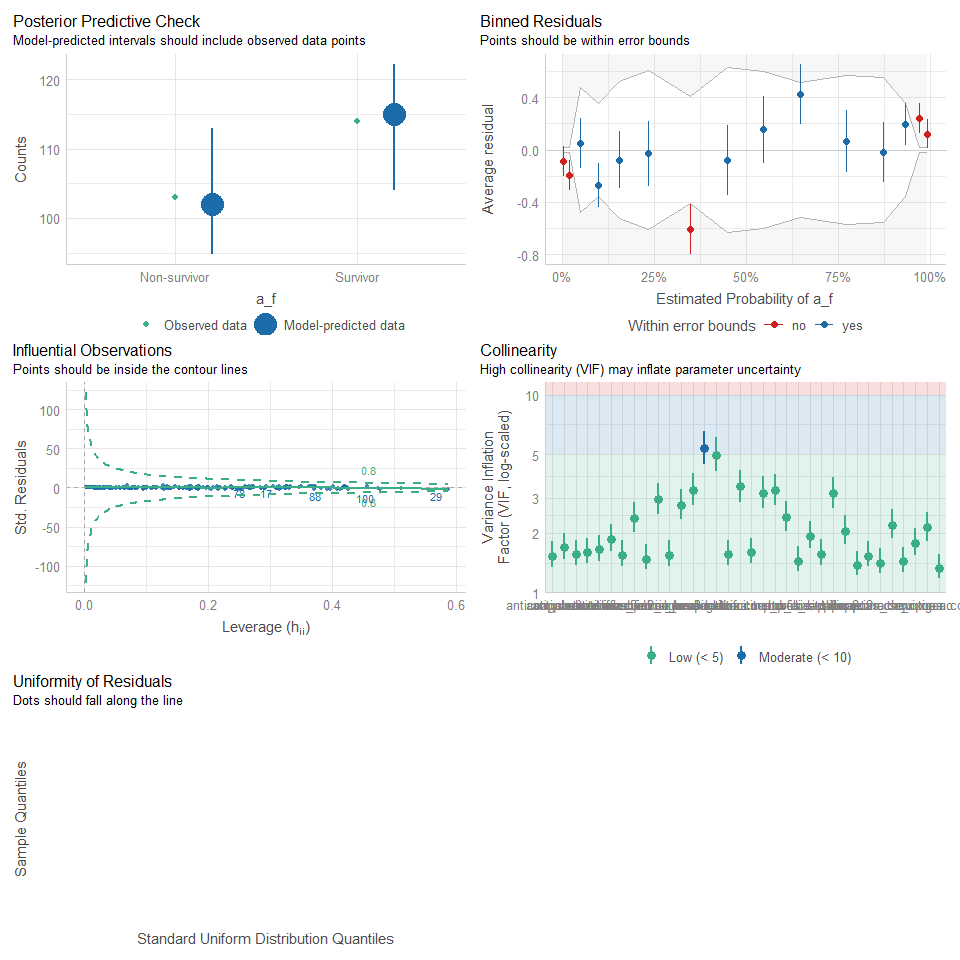

``` r
# Indices of model performance
performance::model_performance(m1)
```

    ## # Indices of model performance
    ## 
    ## AIC     |    AICc |     BIC | Tjur's R2 |  RMSE | Sigma | Log_loss | Score_log | Score_spherical |   PCP
    ## --------------------------------------------------------------------------------------------------------
    ## 238.569 | 255.220 | 367.005 |     0.517 | 0.347 | 1.000 |    0.375 |  -123.763 |           0.020 | 0.759

``` r
# Check for Multicollinearity
performance::check_collinearity(m1)
```

    ## # Check for Multicollinearity
    ## 
    ## Low Correlation
    ## 
    ##                       Term  VIF   VIF 95% CI Increased SE Tolerance
    ##                     edad.c 1.55 [1.36, 1.83]         1.24      0.65
    ##                       sexo 1.43 [1.27, 1.69]         1.20      0.70
    ##                   obesidad 1.44 [1.28, 1.71]         1.20      0.69
    ##                        hta 1.56 [1.38, 1.85]         1.25      0.64
    ##                     fiebre 1.48 [1.31, 1.75]         1.22      0.68
    ##                        tos 2.13 [1.82, 2.54]         1.46      0.47
    ##                  taquipnea 1.78 [1.54, 2.11]         1.33      0.56
    ##                     disnea 1.87 [1.62, 2.22]         1.37      0.54
    ##      estertores_pulmonares 2.38 [2.03, 2.86]         1.54      0.42
    ##  frecuencia_respiratoria.c 2.76 [2.34, 3.33]         1.66      0.36
    ##      frecuencia_cardiaca.c 1.55 [1.36, 1.83]         1.24      0.65
    ##            p_a_sistolica.c 1.57 [1.38, 1.85]         1.25      0.64
    ##           p_a_diastolica.c 1.93 [1.67, 2.30]         1.39      0.52
    ##               leucocitos.c 3.43 [2.87, 4.16]         1.85      0.29
    ##              neutrofilos.c 2.40 [2.04, 2.88]         1.55      0.42
    ##               linfocitos.c 1.60 [1.40, 1.89]         1.26      0.63
    ##                plaquetas.c 1.37 [1.22, 1.62]         1.17      0.73
    ##                        mcv 3.28 [2.75, 3.98]         1.81      0.30
    ##                        mch 3.19 [2.68, 3.86]         1.79      0.31
    ##              hemoglobina.c 4.97 [4.11, 6.07]         2.23      0.20
    ##               creatinina.c 1.65 [1.45, 1.96]         1.29      0.60
    ##                     urea.c 1.32 [1.19, 1.56]         1.15      0.76
    ##    saturacion_de_oxigeno.c 2.20 [1.88, 2.63]         1.48      0.45
    ##                   fio2_aga 2.95 [2.48, 3.56]         1.72      0.34
    ##                     pafi.c 3.16 [2.66, 3.82]         1.78      0.32
    ##                      po2.c 1.53 [1.35, 1.81]         1.24      0.65
    ##                       pco2 2.05 [1.76, 2.45]         1.43      0.49
    ##                     hco3.c 3.31 [2.77, 4.00]         1.82      0.30
    ##                corticoides 1.60 [1.40, 1.89]         1.26      0.63
    ##            anticoagulantes 1.53 [1.35, 1.81]         1.24      0.65
    ##           antiparasitarios 1.56 [1.37, 1.84]         1.25      0.64
    ##              antipaludicos 1.69 [1.47, 2.00]         1.30      0.59
    ##                  pronacion 1.41 [1.26, 1.67]         1.19      0.71
    ##  Tolerance 95% CI
    ##      [0.55, 0.73]
    ##      [0.59, 0.79]
    ##      [0.59, 0.78]
    ##      [0.54, 0.73]
    ##      [0.57, 0.76]
    ##      [0.39, 0.55]
    ##      [0.47, 0.65]
    ##      [0.45, 0.62]
    ##      [0.35, 0.49]
    ##      [0.30, 0.43]
    ##      [0.55, 0.73]
    ##      [0.54, 0.73]
    ##      [0.43, 0.60]
    ##      [0.24, 0.35]
    ##      [0.35, 0.49]
    ##      [0.53, 0.71]
    ##      [0.62, 0.82]
    ##      [0.25, 0.36]
    ##      [0.26, 0.37]
    ##      [0.16, 0.24]
    ##      [0.51, 0.69]
    ##      [0.64, 0.84]
    ##      [0.38, 0.53]
    ##      [0.28, 0.40]
    ##      [0.26, 0.38]
    ##      [0.55, 0.74]
    ##      [0.41, 0.57]
    ##      [0.25, 0.36]
    ##      [0.53, 0.71]
    ##      [0.55, 0.74]
    ##      [0.54, 0.73]
    ##      [0.50, 0.68]
    ##      [0.60, 0.80]
    ## 
    ## Moderate Correlation
    ## 
    ##           Term  VIF   VIF 95% CI Increased SE Tolerance Tolerance 95% CI
    ##  hematocrito.c 5.37 [4.43, 6.56]         2.32      0.19     [0.15, 0.23]

#### Reduced multivariable: step-by-step forward

``` r
mv_reg_stepbackward <- m1 |>
  step(direction = "backward", trace = FALSE)
```

``` r
# Forward model
mv_reg_stepforward <- m1 |>
  step(direction = "forward", trace = FALSE)

# Forward formula-based model
m2 <- glm(
  a_f ~ edad.c + sexo + obesidad + hta + fiebre + tos + taquipnea + disnea +
    estertores_pulmonares + frecuencia_respiratoria.c + frecuencia_cardiaca.c   +
    p_a_sistolica.c + p_a_diastolica.c + leucocitos.c + neutrofilos.c   +
    linfocitos.c + plaquetas.c + mcv + mch + hemoglobina.c + hematocrito.c  +
    creatinina.c + urea.c + saturacion_de_oxigeno.c + fio2_aga  + pafi.c +
    po2.c   + pco2  + hco3.c + corticoides + anticoagulantes + antiparasitarios +
    antipaludicos + pronacion,
  data = data_uv,
  family = binomial(link = "logit"))

# Visual check of model assumptions
performance::check_model(m2)
```


``` r
# Indices of model performance
performance::model_performance(m2)
```

    ## # Indices of model performance
    ## 
    ## AIC     |    AICc |     BIC | Tjur's R2 |  RMSE | Sigma | Log_loss | Score_log | Score_spherical |   PCP
    ## --------------------------------------------------------------------------------------------------------
    ## 238.569 | 255.220 | 367.005 |     0.517 | 0.347 | 1.000 |    0.375 |  -123.763 |           0.020 | 0.759

``` r
# Check for Multicollinearity
performance::check_collinearity(m2)
```

    ## # Check for Multicollinearity
    ## 
    ## Low Correlation
    ## 
    ##                       Term  VIF   VIF 95% CI Increased SE Tolerance
    ##                     edad.c 1.55 [1.36, 1.83]         1.24      0.65
    ##                       sexo 1.43 [1.27, 1.69]         1.20      0.70
    ##                   obesidad 1.44 [1.28, 1.71]         1.20      0.69
    ##                        hta 1.56 [1.38, 1.85]         1.25      0.64
    ##                     fiebre 1.48 [1.31, 1.75]         1.22      0.68
    ##                        tos 2.13 [1.82, 2.54]         1.46      0.47
    ##                  taquipnea 1.78 [1.54, 2.11]         1.33      0.56
    ##                     disnea 1.87 [1.62, 2.22]         1.37      0.54
    ##      estertores_pulmonares 2.38 [2.03, 2.86]         1.54      0.42
    ##  frecuencia_respiratoria.c 2.76 [2.34, 3.33]         1.66      0.36
    ##      frecuencia_cardiaca.c 1.55 [1.36, 1.83]         1.24      0.65
    ##            p_a_sistolica.c 1.57 [1.38, 1.85]         1.25      0.64
    ##           p_a_diastolica.c 1.93 [1.67, 2.30]         1.39      0.52
    ##               leucocitos.c 3.43 [2.87, 4.16]         1.85      0.29
    ##              neutrofilos.c 2.40 [2.04, 2.88]         1.55      0.42
    ##               linfocitos.c 1.60 [1.40, 1.89]         1.26      0.63
    ##                plaquetas.c 1.37 [1.22, 1.62]         1.17      0.73
    ##                        mcv 3.28 [2.75, 3.98]         1.81      0.30
    ##                        mch 3.19 [2.68, 3.86]         1.79      0.31
    ##              hemoglobina.c 4.97 [4.11, 6.07]         2.23      0.20
    ##               creatinina.c 1.65 [1.45, 1.96]         1.29      0.60
    ##                     urea.c 1.32 [1.19, 1.56]         1.15      0.76
    ##    saturacion_de_oxigeno.c 2.20 [1.88, 2.63]         1.48      0.45
    ##                   fio2_aga 2.95 [2.48, 3.56]         1.72      0.34
    ##                     pafi.c 3.16 [2.66, 3.82]         1.78      0.32
    ##                      po2.c 1.53 [1.35, 1.81]         1.24      0.65
    ##                       pco2 2.05 [1.76, 2.45]         1.43      0.49
    ##                     hco3.c 3.31 [2.77, 4.00]         1.82      0.30
    ##                corticoides 1.60 [1.40, 1.89]         1.26      0.63
    ##            anticoagulantes 1.53 [1.35, 1.81]         1.24      0.65
    ##           antiparasitarios 1.56 [1.37, 1.84]         1.25      0.64
    ##              antipaludicos 1.69 [1.47, 2.00]         1.30      0.59
    ##                  pronacion 1.41 [1.26, 1.67]         1.19      0.71
    ##  Tolerance 95% CI
    ##      [0.55, 0.73]
    ##      [0.59, 0.79]
    ##      [0.59, 0.78]
    ##      [0.54, 0.73]
    ##      [0.57, 0.76]
    ##      [0.39, 0.55]
    ##      [0.47, 0.65]
    ##      [0.45, 0.62]
    ##      [0.35, 0.49]
    ##      [0.30, 0.43]
    ##      [0.55, 0.73]
    ##      [0.54, 0.73]
    ##      [0.43, 0.60]
    ##      [0.24, 0.35]
    ##      [0.35, 0.49]
    ##      [0.53, 0.71]
    ##      [0.62, 0.82]
    ##      [0.25, 0.36]
    ##      [0.26, 0.37]
    ##      [0.16, 0.24]
    ##      [0.51, 0.69]
    ##      [0.64, 0.84]
    ##      [0.38, 0.53]
    ##      [0.28, 0.40]
    ##      [0.26, 0.38]
    ##      [0.55, 0.74]
    ##      [0.41, 0.57]
    ##      [0.25, 0.36]
    ##      [0.53, 0.71]
    ##      [0.55, 0.74]
    ##      [0.54, 0.73]
    ##      [0.50, 0.68]
    ##      [0.60, 0.80]
    ## 
    ## Moderate Correlation
    ## 
    ##           Term  VIF   VIF 95% CI Increased SE Tolerance Tolerance 95% CI
    ##  hematocrito.c 5.37 [4.43, 6.56]         2.32      0.19     [0.15, 0.23]

#### Reduced multivariable: step-by-step backward

``` r
# Backward model
mv_reg_stepbackward <- m1 |>
  step(direction = "backward", trace = FALSE)

# Backward formula-based model
m3 <-
  glm(
    a_f ~ disnea + estertores_pulmonares + frecuencia_respiratoria.c +
      frecuencia_cardiaca.c + p_a_sistolica.c + neutrofilos.c + linfocitos.c + 
      mcv + mch + hematocrito.c + fio2_aga + po2.c + corticoides + pronacion,
    data = data_uv,
    family = binomial(link = "logit"))

# Visual check of model assumptions
performance::check_model(m3)
```

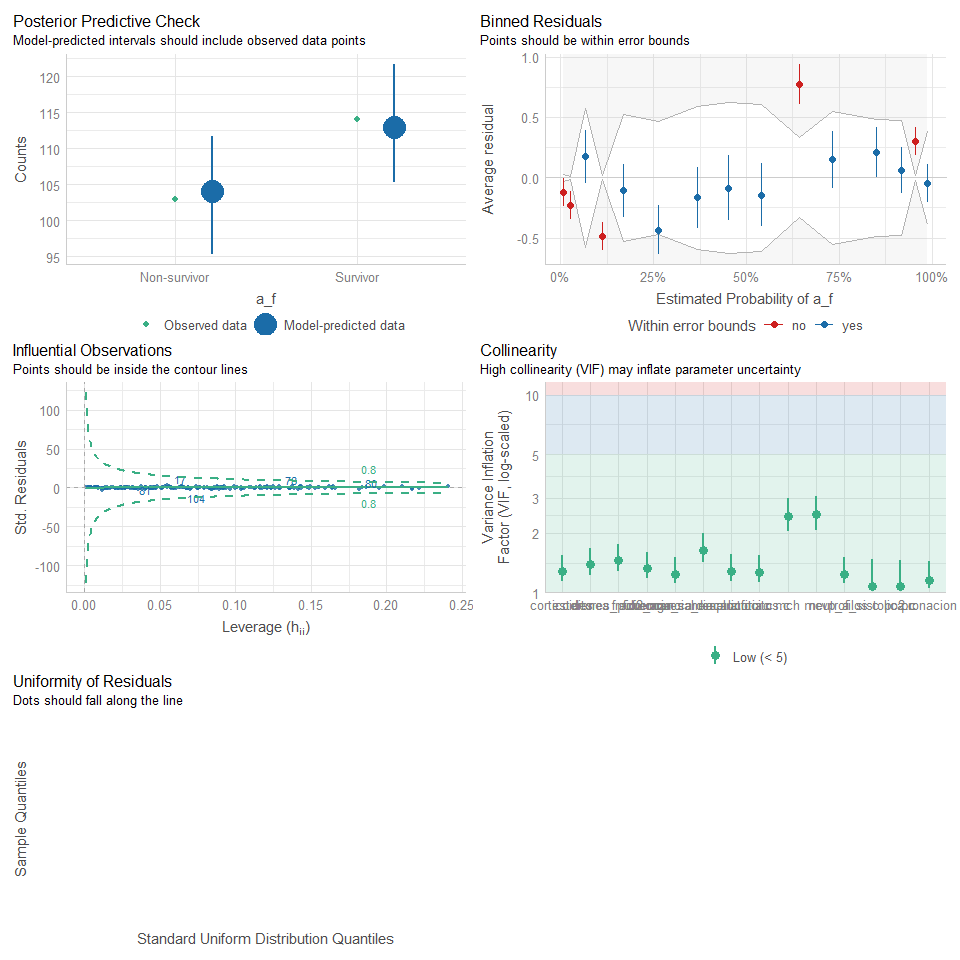

``` r
# Indices of model performance
performance::model_performance(m3)
```

    ## # Indices of model performance
    ## 
    ## AIC     |    AICc |     BIC | Tjur's R2 |  RMSE | Sigma | Log_loss | Score_log | Score_spherical |   PCP
    ## --------------------------------------------------------------------------------------------------------
    ## 205.935 | 208.655 | 260.013 |     0.489 | 0.354 | 1.000 |    0.401 |  -114.684 |           0.017 | 0.745

``` r
# Check for Multicollinearity
performance::check_collinearity(m3)
```

    ## # Check for Multicollinearity
    ## 
    ## Low Correlation
    ## 
    ##                       Term  VIF   VIF 95% CI Increased SE Tolerance
    ##                     disnea 1.39 [1.22, 1.67]         1.18      0.72
    ##      estertores_pulmonares 1.46 [1.28, 1.76]         1.21      0.69
    ##  frecuencia_respiratoria.c 1.65 [1.42, 2.00]         1.28      0.61
    ##      frecuencia_cardiaca.c 1.24 [1.11, 1.51]         1.11      0.81
    ##            p_a_sistolica.c 1.08 [1.01, 1.47]         1.04      0.93
    ##              neutrofilos.c 1.24 [1.11, 1.51]         1.11      0.81
    ##               linfocitos.c 1.27 [1.13, 1.54]         1.12      0.79
    ##                        mcv 2.49 [2.07, 3.06]         1.58      0.40
    ##                        mch 2.44 [2.03, 3.00]         1.56      0.41
    ##              hematocrito.c 1.28 [1.14, 1.55]         1.13      0.78
    ##                   fio2_aga 1.33 [1.18, 1.60]         1.15      0.75
    ##                      po2.c 1.08 [1.01, 1.46]         1.04      0.92
    ##                corticoides 1.28 [1.14, 1.55]         1.13      0.78
    ##                  pronacion 1.16 [1.06, 1.43]         1.08      0.86
    ##  Tolerance 95% CI
    ##      [0.60, 0.82]
    ##      [0.57, 0.78]
    ##      [0.50, 0.70]
    ##      [0.66, 0.90]
    ##      [0.68, 0.99]
    ##      [0.66, 0.90]
    ##      [0.65, 0.88]
    ##      [0.33, 0.48]
    ##      [0.33, 0.49]
    ##      [0.64, 0.87]
    ##      [0.62, 0.85]
    ##      [0.68, 0.99]
    ##      [0.65, 0.88]
    ##      [0.70, 0.95]

#### Parsimonious model

``` r
# Parsimonious formula
m4 <-
  glm(
    a_f ~ edad.c + obesidad + hta + taquipnea + disnea + estertores_pulmonares +
      frecuencia_cardiaca.c + p_a_sistolica.c   + neutrofilos.c + linfocitos.c + 
      mch + hemoglobina.c + urea.c + saturacion_de_oxigeno.c    + pafi.c + po2.c +
      hco3.c + corticoides,
    data = data_uv,
    family = binomial(link = "logit"))

# Visual check of model assumptions
check_model(m4)
```

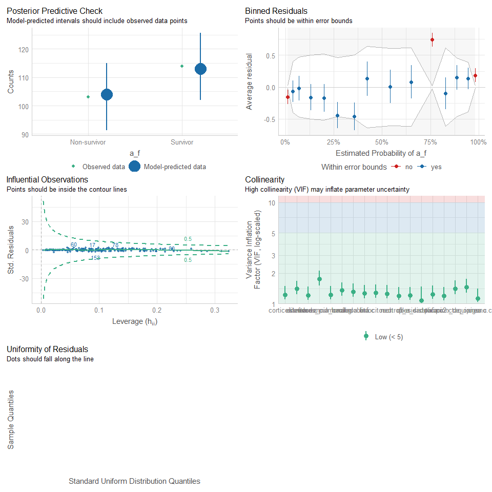

``` r
# Indices of model performance
model_performance(m4)
```

    ## # Indices of model performance
    ## 
    ## AIC     |    AICc |     BIC | Tjur's R2 |  RMSE | Sigma | Log_loss | Score_log | Score_spherical |   PCP
    ## --------------------------------------------------------------------------------------------------------
    ## 221.403 | 225.688 | 289.001 |     0.464 | 0.364 | 1.000 |    0.418 |  -108.461 |           0.017 | 0.733

``` r
# Check for Multicollinearity
check_collinearity(m4)
```

    ## # Check for Multicollinearity
    ## 
    ## Low Correlation
    ## 
    ##                     Term  VIF   VIF 95% CI Increased SE Tolerance
    ##                   edad.c 1.21 [1.09, 1.47]         1.10      0.83
    ##                 obesidad 1.20 [1.09, 1.46]         1.10      0.83
    ##                      hta 1.26 [1.13, 1.53]         1.12      0.79
    ##                taquipnea 1.46 [1.28, 1.76]         1.21      0.69
    ##                   disnea 1.40 [1.23, 1.68]         1.18      0.71
    ##    estertores_pulmonares 1.75 [1.50, 2.12]         1.32      0.57
    ##    frecuencia_cardiaca.c 1.22 [1.10, 1.49]         1.11      0.82
    ##          p_a_sistolica.c 1.07 [1.01, 1.47]         1.04      0.93
    ##            neutrofilos.c 1.20 [1.08, 1.46]         1.09      0.84
    ##             linfocitos.c 1.28 [1.15, 1.55]         1.13      0.78
    ##                      mch 1.26 [1.13, 1.52]         1.12      0.79
    ##            hemoglobina.c 1.31 [1.17, 1.58]         1.14      0.76
    ##                   urea.c 1.13 [1.04, 1.41]         1.06      0.89
    ##  saturacion_de_oxigeno.c 1.41 [1.24, 1.70]         1.19      0.71
    ##                   pafi.c 1.24 [1.12, 1.51]         1.12      0.80
    ##                    po2.c 1.19 [1.08, 1.46]         1.09      0.84
    ##                   hco3.c 1.35 [1.20, 1.63]         1.16      0.74
    ##              corticoides 1.23 [1.11, 1.49]         1.11      0.81
    ##  Tolerance 95% CI
    ##      [0.68, 0.92]
    ##      [0.68, 0.92]
    ##      [0.66, 0.88]
    ##      [0.57, 0.78]
    ##      [0.59, 0.81]
    ##      [0.47, 0.67]
    ##      [0.67, 0.91]
    ##      [0.68, 0.99]
    ##      [0.69, 0.92]
    ##      [0.65, 0.87]
    ##      [0.66, 0.89]
    ##      [0.63, 0.86]
    ##      [0.71, 0.96]
    ##      [0.59, 0.80]
    ##      [0.66, 0.89]
    ##      [0.69, 0.92]
    ##      [0.61, 0.84]
    ##      [0.67, 0.90]

### Model comparison

``` r
# Compare performance of different models
compare_performance(m2, m3, m4, verbose = FALSE)
```

    ## # Comparison of Model Performance Indices
    ## 
    ## Name | Model | AIC (weights) | AICc (weights) | BIC (weights) | Tjur's R2 |  RMSE | Sigma | Log_loss | Score_log | Score_spherical |   PCP
    ## ------------------------------------------------------------------------------------------------------------------------------------------
    ## m2   |   glm | 238.6 (<.001) |  255.2 (<.001) | 367.0 (<.001) |     0.517 | 0.347 | 1.000 |    0.375 |  -123.763 |           0.020 | 0.759
    ## m3   |   glm | 205.9 (>.999) |  208.7 (>.999) | 260.0 (>.999) |     0.489 | 0.354 | 1.000 |    0.401 |  -114.684 |           0.017 | 0.745
    ## m4   |   glm | 221.4 (<.001) |  225.7 (<.001) | 289.0 (<.001) |     0.464 | 0.364 | 1.000 |    0.418 |  -108.461 |           0.017 | 0.733

``` r
# Radar plot
plot(compare_performance(m2, m3, m4, rank = TRUE, verbose = FALSE))
```

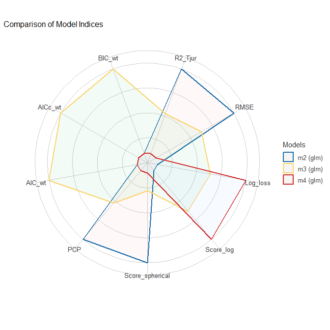

``` r
# Likelihood Ratio Test
lmtest::lrtest(m3, m4)
```

    ## Likelihood ratio test
    ## 
    ## Model 1: a_f ~ disnea + estertores_pulmonares + frecuencia_respiratoria.c + 
    ##     frecuencia_cardiaca.c + p_a_sistolica.c + neutrofilos.c + 
    ##     linfocitos.c + mcv + mch + hematocrito.c + fio2_aga + po2.c + 
    ##     corticoides + pronacion
    ## Model 2: a_f ~ edad.c + obesidad + hta + taquipnea + disnea + estertores_pulmonares + 
    ##     frecuencia_cardiaca.c + p_a_sistolica.c + neutrofilos.c + 
    ##     linfocitos.c + mch + hemoglobina.c + urea.c + saturacion_de_oxigeno.c + 
    ##     pafi.c + po2.c + hco3.c + corticoides
    ##   #Df  LogLik Df  Chisq Pr(>Chisq)
    ## 1  16 -86.968                     
    ## 2  20 -90.701  4 7.4676     0.1131

> Likelihood Ratio Test (0.1131): There is insufficient evidence to
> conclude that the backward model is significantly better than the
> parsimonious model.

``` r
# Final model
table_3.2 <-
  glm(
    a_f ~ edad.c + obesidad + hta + taquipnea + disnea + estertores_pulmonares +
      frecuencia_cardiaca.c + p_a_sistolica.c   + neutrofilos.c + linfocitos.c + 
      mch + hemoglobina.c + urea.c + saturacion_de_oxigeno.c    + pafi.c + po2.c +
      hco3.c + corticoides,
    family = binomial(link = "logit"),
    data = data_uv
  ) |>
  tbl_regression(
    conf.int = TRUE,
    exponentiate = TRUE,
    pvalue_fun = ~ style_pvalue(.x, digits = 3),
    estimate_fun = ~ style_number(.x, digits = 2),
    label = list(
      edad.c ~ "Age (years)",
      obesidad ~ "Obesity",
      hta ~ "Hypertension",
      taquipnea ~ "Tachypnea",
      disnea ~ "Dyspnea",
      estertores_pulmonares ~ "Lung crackles",
      frecuencia_cardiaca.c ~ "Heart rate (BPM)",
      p_a_sistolica.c ~ "SBP (mmHg)",
      neutrofilos.c ~ "Neutrophils (×10^−9^/L)",
      linfocitos.c ~ "Lymphocytes (×10^−9^/L)",
      mch ~ "MCH (pg)",
      hemoglobina.c ~ "Hemoglobin (g/dL)",
      urea.c ~ "BUN (mg/dL)",
      saturacion_de_oxigeno.c ~ "SaO~2~",
      pafi.c ~ "PaO~2~:FiO~2~ ratio",
      po2.c ~ "PaO~2~ (mmHg)",
      hco3.c ~ "HCO~3~ (mmol/L)",
      corticoides ~ "Corticosteroids")) |>
  bold_p(t = 0.05) |>
  add_vif() |>
  modify_header(estimate = "**Multivariable OR (95% CI)**",
                p.value = "**p value** ")

# Merge tables
table_3 <- tbl_merge(tbls = list(table_3.1, table_3.2)) |>
  modify_spanning_header(everything() ~ NA_character_)

# Convert gtsummary object to a flextable object and format character columns
flex_table_3 <- table_3 |>
  gtsummary::as_flex_table() |>
  my_flextable_theme() |>
  flextable::fontsize(part = "all", size = 10) |>
  ftExtra::colformat_md()

# View
flex_table_3
```


<div style="text-align: justify">

PCA is an excellent technique for reducing data complexity before
applying other analytical methods, such as linear regression, k-means
clustering, and random forest classification. Integrating PCA with other
methods enhances data analysis, model building, and interpretation,
resulting in more accurate and efficient results. The choice between PCA
and factor analysis depends on the objectives of the analysis.

</div>

## Dimensional reduction

### Principal Component Analysis (PCA)

<div style="text-align: justify">

The PCA is a statistical technique that reduces the dimensionality of a
dataset. This process transforms high-dimensional (complex or large)
data sets into simpler (smaller) data sets while preserving important
information. It helps to remove noise and redundancy from the data set,
making the true patterns more pronounced and easier to analyze. With
fewer dimensions, it’s possible to visually explore and understand
complex data sets, focusing on the most relevant features. By
identifying the principal components, it’s possible to focus on the most
influential variables or individuals driving the trends and patterns in
the data. This significantly reduces the complexity of interpreting data
and makes it easier to explore and visualize. The output of PCA includes
the variance explained by each principal component, which helps to
understand the importance of each component in the analysis. This is
crucial for making informed decisions based on the data. Furthermore,
this process is crucial for more effectively analyzing data. The
application of PCA can facilitate the acceleration of learning
algorithms employed in data analysis, thereby enabling a more efficient
and faster process. A reduction in data volume will result in a decrease
in the storage and computational resources required. PCA is not merely a
mathematical technique; it’s a strategic approach to dealing with data
in the most efficient way possible.

</div>

> 📝***NOTE:*** PCA only works with numerical values.

#### Variables

``` r
numerical <- data |>
  dplyr::select(where(is.numeric), a_f) |>
  na.omit()

# Rename variables
numerical = rename(
  numerical,
  "Age" = edad,
  "Respiratory rate" = frecuencia_respiratoria,
  "Heart rate" = frecuencia_cardiaca,
  "SBP" = p_a_sistolica,
  "DBP" = p_a_diastolica,
  "White-cells" = leucocitos,
  "Neutrophils" = neutrofilos,
  "Lymphocytes" = linfocitos,
  "Platelets" = plaquetas,
  "MCV" = mcv,
  "MCH" = mch,
  "Hemoglobin" = hemoglobina,
  "Hematocrit" = hematocrito,
  "Serum creatinine" = creatinina,
  "BUN" = urea,
  "Glucose" = glucosa,
  "pH" = ph,
  "Anion Gap" = anion_gap,
  "Sodium" = sodio,
  "Potasium " = potasio,
  "Chlorine" = cloro,
  "Calcium" = calcio,
  "SaO2" = saturacion_de_oxigeno,
  "FiO2" = fio2_aga,
  "PaO2:FiO2 ratio" = pafi,
  "PaO2" = po2,
  "PCO2" = pco2,
  "HCO3" = hco3,
  "Duration of disease" = t_de_enfermedad)
```

<div style="text-align: justify">

The first step is to utilize the `prcomp()` function from the `stats`
package to perform PCA, with the parameters **centered** and **scaled**.
This function is robust and offers a standardized method to perform PCA
with ease, providing the user with the principal components, variance
captured, and more. The next step is to examine the summary with the
`summary()` or `get_eigenvalue()` functions. This will allow you to
understand the proportion of variance represented in each principal
component and determine which variables contribute the most to them.
This information allows us to evaluate the importance and contribution
of each principal component.

</div>

> 📝***NOTE:*** The eigenvalues represent the variance explained by each
> principal component.

<div style="text-align: justify">

Explore the mathematical concepts of eigenvalues and eigenvectors.
Eigenvalues measure the variance captured by each principal component. A
higher eigenvalue indicates that the component accounts for a greater
proportion of the variance in the data set. This allows for the
determination of which principal components are worth keeping for
analysis. Eigenvectors, on the other hand, define the direction of the
principal components, which are formed by the combination of the
original variables. In addition, eigenvectors are perpendicular
(orthogonal) to each other, representing a new axis in data space that
is aligned with the maximum variance. This orthogonal property ensures
that the principal components are independent of each other. The
eigenvalues and eigenvectors operate in tandem within PCA to transform
and simplify the data set. By identifying new axes (eigenvectors) that
maximize variance (eigenvalues), PCA allows the data to be viewed from a
different perspective, focusing on the most informative aspects.

</div>

``` r
# Scaled (standardization)
pca_data <- stats::prcomp(numerical[1:29], scale. = TRUE, center = TRUE)

# Extract eigenvalues of dimensions
get_eigenvalue(pca_data) |>
  mutate(across(where(is.numeric), round, 2))
```

    ##        eigenvalue variance.percent cumulative.variance.percent
    ## Dim.1        3.67            12.66                       12.66
    ## Dim.2        3.08            10.63                       23.30
    ## Dim.3        2.68             9.23                       32.53
    ## Dim.4        2.50             8.64                       41.16
    ## Dim.5        2.15             7.41                       48.57
    ## Dim.6        1.69             5.83                       54.41
    ## Dim.7        1.40             4.84                       59.25
    ## Dim.8        1.29             4.46                       63.71
    ## Dim.9        1.22             4.20                       67.91
    ## Dim.10       0.97             3.36                       71.26
    ## Dim.11       0.95             3.29                       74.55
    ## Dim.12       0.94             3.23                       77.78
    ## Dim.13       0.86             2.97                       80.76
    ## Dim.14       0.80             2.76                       83.52
    ## Dim.15       0.69             2.38                       85.90
    ## Dim.16       0.62             2.14                       88.04
    ## Dim.17       0.57             1.96                       90.00
    ## Dim.18       0.51             1.76                       91.76
    ## Dim.19       0.48             1.65                       93.42
    ## Dim.20       0.44             1.50                       94.92
    ## Dim.21       0.38             1.31                       96.23
    ## Dim.22       0.30             1.03                       97.25
    ## Dim.23       0.25             0.86                       98.12
    ## Dim.24       0.23             0.79                       98.90
    ## Dim.25       0.20             0.69                       99.59
    ## Dim.26       0.09             0.32                       99.91
    ## Dim.27       0.02             0.05                       99.97
    ## Dim.28       0.01             0.03                      100.00
    ## Dim.29       0.00             0.00                      100.00

<div style="text-align: justify">

To visualize the PCA, the `ggplot2` and `factoextra` packages can be
utilized. Plots such as scree plots can be used to understand the
variance explained (eigenvalues) by each component or biplots to
understand the relationship between variables and components and how the
data is distributed across these new dimensions (principal components).
This helps to reveal patterns and clusters. A scree plot assesses the
contribution of each component to the total variance. It determines the
optimal number of principal components to keep, streamlines the analysis
by focusing on the most important components.

</div>

``` r
# Graph eigenvalues of dimensions
fviz_eig(pca_data, addlabels = TRUE)
```

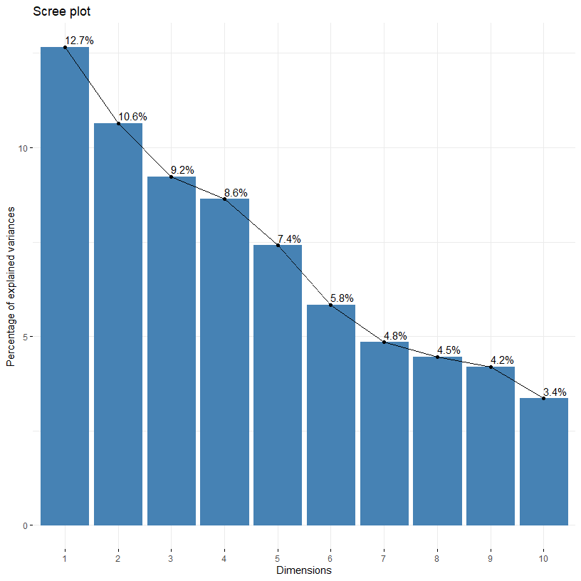

``` r
# Extract results for the variables
var <- get_pca_var(pca_data)

# Coordinates for the variables
head(var$coord, 5)
```

    ##                          Dim.1       Dim.2       Dim.3       Dim.4        Dim.5
    ## Age                 0.13793571 -0.29298932  0.31889191 -0.48021918  0.001231555
    ## Duration of disease 0.07705455  0.30797270 -0.15562940 -0.13340462 -0.135760747
    ## Respiratory rate    0.42512727  0.12444667  0.25178565 -0.05537507  0.019660484
    ## Heart rate          0.40076375  0.03431569  0.12107888  0.33155639  0.163523246
    ## SBP                 0.23732980  0.03691180 -0.04096375 -0.15242668 -0.416958818
    ##                           Dim.6       Dim.7      Dim.8       Dim.9     Dim.10
    ## Age                 -0.05282346  0.21944874 -0.1156983 -0.14677331  0.1882642
    ## Duration of disease  0.14792756  0.55430839  0.1765128 -0.09413535 -0.3653366
    ## Respiratory rate     0.07161578 -0.02520474  0.1438517  0.52755436  0.0631021
    ## Heart rate           0.05850435 -0.25222452  0.1090153  0.14715792 -0.4459125
    ## SBP                 -0.66204816  0.09083433  0.1486886  0.05632047 -0.1161401
    ##                          Dim.11      Dim.12      Dim.13      Dim.14
    ## Age                  0.27889860 -0.24829218 -0.06595216 -0.04988704
    ## Duration of disease -0.14516515  0.24862086 -0.25083105 -0.08527321
    ## Respiratory rate     0.24171277  0.02463346  0.16137403  0.10877074
    ## Heart rate           0.05802321  0.05921626 -0.14949305  0.33637594
    ## SBP                  0.19254530 -0.12613019  0.19090981  0.03570950
    ##                           Dim.15      Dim.16      Dim.17       Dim.18
    ## Age                 -0.119479119  0.42512052  0.05106745  0.115250568
    ## Duration of disease  0.203754350  0.04275563 -0.10717998 -0.163915084
    ## Respiratory rate     0.486994311 -0.01681545  0.06157847 -0.030150754
    ## Heart rate           0.005816853  0.39914149  0.01242834  0.068698949
    ## SBP                  0.008357435  0.06879743 -0.06579069 -0.008816533
    ##                         Dim.19      Dim.20       Dim.21      Dim.22      Dim.23
    ## Age                 -0.1731596 -0.14233007 -0.008418955  0.14183943  0.05088390
    ## Duration of disease -0.1463257 -0.27763880  0.002075131  0.02058998  0.03408471
    ## Respiratory rate    -0.2315247  0.14036737  0.084054547  0.07826499 -0.01541691
    ## Heart rate           0.2778201 -0.01906413 -0.017924601  0.04247773 -0.01880004
    ## SBP                 -0.0541121 -0.03606199 -0.288783372 -0.23937490 -0.07695439
    ##                          Dim.24      Dim.25       Dim.26       Dim.27
    ## Age                  0.09572682 -0.04561185 -0.008467372  0.002313491
    ## Duration of disease -0.00622437  0.02771622  0.021714755 -0.001443580
    ## Respiratory rate     0.03547441  0.03349921 -0.002895447  0.000393253
    ## Heart rate          -0.02031345  0.01621989 -0.012935127  0.001264951
    ## SBP                 -0.07482442  0.04203647 -0.009528711 -0.001076432
    ##                            Dim.28       Dim.29
    ## Age                  0.0004240986 0.000000e+00
    ## Duration of disease -0.0002880918 1.321631e-32
    ## Respiratory rate     0.0014673717 1.684505e-32
    ## Heart rate           0.0005845629 7.909549e-33
    ## SBP                  0.0005173954 1.076707e-32

``` r
# Correlations between variables and dimensions
head(var$cor, 4)
```

    ##                          Dim.1       Dim.2      Dim.3       Dim.4        Dim.5
    ## Age                 0.13793571 -0.29298932  0.3188919 -0.48021918  0.001231555
    ## Duration of disease 0.07705455  0.30797270 -0.1556294 -0.13340462 -0.135760747
    ## Respiratory rate    0.42512727  0.12444667  0.2517857 -0.05537507  0.019660484
    ## Heart rate          0.40076375  0.03431569  0.1210789  0.33155639  0.163523246
    ##                           Dim.6       Dim.7      Dim.8       Dim.9     Dim.10
    ## Age                 -0.05282346  0.21944874 -0.1156983 -0.14677331  0.1882642
    ## Duration of disease  0.14792756  0.55430839  0.1765128 -0.09413535 -0.3653366
    ## Respiratory rate     0.07161578 -0.02520474  0.1438517  0.52755436  0.0631021
    ## Heart rate           0.05850435 -0.25222452  0.1090153  0.14715792 -0.4459125
    ##                          Dim.11      Dim.12      Dim.13      Dim.14
    ## Age                  0.27889860 -0.24829218 -0.06595216 -0.04988704
    ## Duration of disease -0.14516515  0.24862086 -0.25083105 -0.08527321
    ## Respiratory rate     0.24171277  0.02463346  0.16137403  0.10877074
    ## Heart rate           0.05802321  0.05921626 -0.14949305  0.33637594
    ##                           Dim.15      Dim.16      Dim.17      Dim.18     Dim.19
    ## Age                 -0.119479119  0.42512052  0.05106745  0.11525057 -0.1731596
    ## Duration of disease  0.203754350  0.04275563 -0.10717998 -0.16391508 -0.1463257
    ## Respiratory rate     0.486994311 -0.01681545  0.06157847 -0.03015075 -0.2315247
    ## Heart rate           0.005816853  0.39914149  0.01242834  0.06869895  0.2778201
    ##                          Dim.20       Dim.21     Dim.22      Dim.23      Dim.24
    ## Age                 -0.14233007 -0.008418955 0.14183943  0.05088390  0.09572682
    ## Duration of disease -0.27763880  0.002075131 0.02058998  0.03408471 -0.00622437
    ## Respiratory rate     0.14036737  0.084054547 0.07826499 -0.01541691  0.03547441
    ## Heart rate          -0.01906413 -0.017924601 0.04247773 -0.01880004 -0.02031345
    ##                          Dim.25       Dim.26       Dim.27        Dim.28
    ## Age                 -0.04561185 -0.008467372  0.002313491  0.0004240986
    ## Duration of disease  0.02771622  0.021714755 -0.001443580 -0.0002880918
    ## Respiratory rate     0.03349921 -0.002895447  0.000393253  0.0014673717
    ## Heart rate           0.01621989 -0.012935127  0.001264951  0.0005845629
    ##                           Dim.29
    ## Age                 0.000000e+00
    ## Duration of disease 1.321631e-32
    ## Respiratory rate    1.684505e-32
    ## Heart rate          7.909549e-33

``` r
# Quality of representation (Cos2) for the  variables on the dimensions
head(var$cos2, 5)
```

    ##                           Dim.1       Dim.2       Dim.3       Dim.4
    ## Age                 0.019026260 0.085842740 0.101692050 0.230610466
    ## Duration of disease 0.005937403 0.094847181 0.024220509 0.017796794
    ## Respiratory rate    0.180733200 0.015486973 0.063396014 0.003066399
    ## Heart rate          0.160611586 0.001177567 0.014660096 0.109929642
    ## SBP                 0.056325434 0.001362481 0.001678029 0.023233893
    ##                            Dim.5       Dim.6       Dim.7      Dim.8       Dim.9
    ## Age                 1.516727e-06 0.002790318 0.048157752 0.01338611 0.021542404
    ## Duration of disease 1.843098e-02 0.021882563 0.307257794 0.03115677 0.008861465
    ## Respiratory rate    3.865346e-04 0.005128820 0.000635279 0.02069332 0.278313600
    ## Heart rate          2.673985e-02 0.003422759 0.063617206 0.01188433 0.021655452
    ## SBP                 1.738547e-01 0.438307764 0.008250875 0.02210830 0.003171995
    ##                          Dim.10      Dim.11       Dim.12      Dim.13
    ## Age                 0.035443399 0.077784428 0.0616490056 0.004349688
    ## Duration of disease 0.133470810 0.021072921 0.0618123315 0.062916218
    ## Respiratory rate    0.003981875 0.058425065 0.0006068073 0.026041578
    ## Heart rate          0.198837988 0.003366693 0.0035065649 0.022348172
    ## SBP                 0.013488533 0.037073693 0.0159088239 0.036446557
    ##                          Dim.14       Dim.15       Dim.16       Dim.17
    ## Age                 0.002488716 1.427526e-02 0.1807274582 0.0026078844
    ## Duration of disease 0.007271521 4.151584e-02 0.0018280441 0.0114875477
    ## Respiratory rate    0.011831073 2.371635e-01 0.0002827595 0.0037919082
    ## Heart rate          0.113148776 3.383578e-05 0.1593139309 0.0001544637
    ## SBP                 0.001275168 6.984672e-05 0.0047330871 0.0043284145
    ##                           Dim.18      Dim.19      Dim.20       Dim.21
    ## Age                 1.328269e-02 0.029984239 0.020257849 7.087881e-05
    ## Duration of disease 2.686815e-02 0.021411208 0.077083303 4.306169e-06
    ## Respiratory rate    9.090679e-04 0.053603694 0.019703000 7.065167e-03
    ## Heart rate          4.719546e-03 0.077184027 0.000363441 3.212913e-04
    ## SBP                 7.773125e-05 0.002928119 0.001300467 8.339584e-02
    ##                           Dim.22       Dim.23       Dim.24       Dim.25
    ## Age                 0.0201184235 0.0025891712 9.163625e-03 0.0020804408
    ## Duration of disease 0.0004239473 0.0011617675 3.874278e-05 0.0007681886
    ## Respiratory rate    0.0061254091 0.0002376810 1.258434e-03 0.0011221971
    ## Heart rate          0.0018043571 0.0003534417 4.126364e-04 0.0002630848
    ## SBP                 0.0573003410 0.0059219778 5.598694e-03 0.0017670650
    ##                           Dim.26       Dim.27       Dim.28       Dim.29
    ## Age                 7.169640e-05 5.352242e-06 1.798597e-07 0.000000e+00
    ## Duration of disease 4.715306e-04 2.083924e-06 8.299686e-08 1.746709e-64
    ## Respiratory rate    8.383612e-06 1.546479e-07 2.153180e-06 2.837558e-64
    ## Heart rate          1.673175e-04 1.600102e-06 3.417138e-07 6.256096e-65
    ## SBP                 9.079633e-05 1.158706e-06 2.676980e-07 1.159299e-64

``` r
# Correlation matrix - Cos2 for the variables
my_ggcorrplor(var$cos2)
```

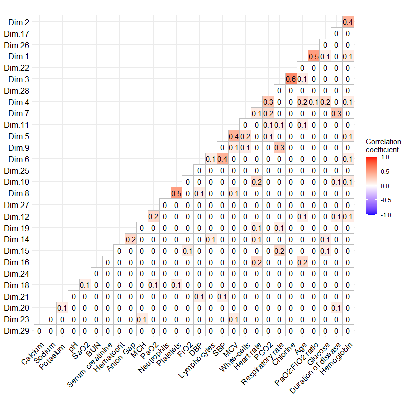

``` r
# Cos2 plot for the variables on dimensions 1 and 2
fviz_cos2(pca_data, choice = "var", axes = 1:2)
```

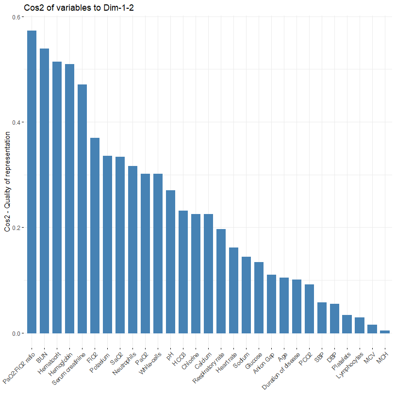

``` r
# Plot of 10 variables with highest cos2 on PC1 and PC2
a <- fviz_cos2(pca_data, choice = "var", axes = 1:2, top = 10)

# Plot of 10 variables with highest cos2 on PC3 and PC4
b <- fviz_cos2(pca_data, choice = "var", axes = 3:4, top = 10)

# Correlations circle and color by cos2 values
c <- fviz_pca_var(
  pca_data,
  col.var = "cos2",
  gradient.cols = c("#fee0d2", "#fc9272", "#de2d26"),
  repel = TRUE) # repel = TRUE avoid text overlapping

# Contributions of the variables on the dimensions
head(var$contrib, 5)
```

    ##                         Dim.1      Dim.2      Dim.3     Dim.4        Dim.5
    ## Age                 0.5181309 2.78360214 3.79936060 9.2086043 7.058888e-05
    ## Duration of disease 0.1616898 3.07558701 0.90491292 0.7106513 8.577827e-01
    ## Respiratory rate    4.9218010 0.50219238 2.36856589 0.1224457 1.798942e-02
    ## Heart rate          4.3738409 0.03818468 0.54772216 4.3896471 1.244480e+00
    ## SBP                 1.5338774 0.04418084 0.06269356 0.9277624 8.091241e+00
    ##                          Dim.6       Dim.7     Dim.8      Dim.9     Dim.10
    ## Age                  0.1649038  3.42862484 1.0353084  1.7688313  3.6426396
    ## Duration of disease  1.2932283 21.87543369 2.4097273  0.7276085 13.7172526
    ## Respiratory rate     0.3031059  0.04522913 1.6004629 22.8521289  0.4092309
    ## Heart rate           0.2022802  4.52927154 0.9191582  1.7781135 20.4352615
    ## SBP                 25.9033638  0.58742684 1.7099003  0.2604503  1.3862628
    ##                        Dim.11     Dim.12    Dim.13     Dim.14      Dim.15
    ## Age                 8.1601804 6.57220525 0.5044469  0.3104996  2.07145763
    ## Duration of disease 2.2107104 6.58961690 7.2965904  0.9072165  6.02428919
    ## Respiratory rate    6.1292354 0.06468981 3.0201231  1.4760797 34.41436886
    ## Heart rate          0.3531918 0.37382378 2.5917874 14.1167760  0.00490985
    ## SBP                 3.8893134 1.69598933 4.2268211  0.1590938  0.01013533
    ##                          Dim.16     Dim.17     Dim.18     Dim.19     Dim.20
    ## Age                 29.07863997 0.45888079 2.59892072  6.2533740  4.6449735
    ## Duration of disease  0.29412817 2.02133766 5.25708164  4.4654223 17.6746253
    ## Respiratory rate     0.04549536 0.66722047 0.17787021 11.1793380  4.5177506
    ## Heart rate          25.63325177 0.02717927 0.92343656 16.0971429  0.0833343
    ## SBP                  0.76154302 0.76162359 0.01520907  0.6106749  0.2981875
    ##                           Dim.21     Dim.22     Dim.23     Dim.24    Dim.25
    ## Age                  0.018683576  6.7632954 1.03496718 4.02343740 1.0433952
    ## Duration of disease  0.001135102  0.1425201 0.46439233 0.01701065 0.3852666
    ## Respiratory rate     1.862370277  2.0592046 0.09500803 0.55253558 0.5628110
    ## Heart rate           0.084692040  0.6065784 0.14128093 0.18117465 0.1319439
    ## SBP                 21.983051277 19.2628975 2.36718714 2.45819694 0.8862291
    ##                          Dim.26       Dim.27       Dim.28       Dim.29
    ## Age                 0.076092691 0.0345646035 0.0019087414 0.000000e+00
    ## Duration of disease 0.500444000 0.0134579160 0.0008807954 3.595821e-31
    ## Respiratory rate    0.008897681 0.0009987114 0.0228503906 5.841473e-31
    ## Heart rate          0.177577129 0.0103334038 0.0036264018 1.287897e-31
    ## SBP                 0.096363803 0.0074828891 0.0028409166 2.386563e-31

``` r
# Correlation matrix - contributions of the variables
corrplot(var$contrib, is.corr=FALSE)
```

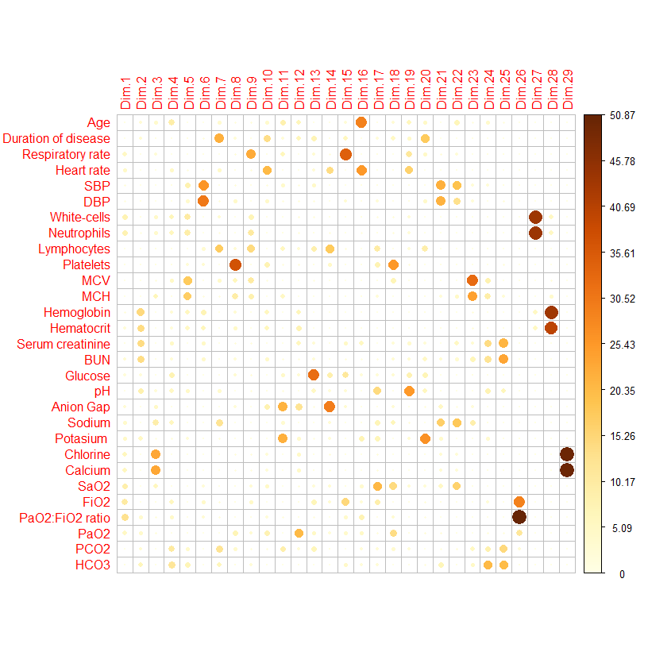

``` r
# Contribution plot of the top 10 variables on PC1
fviz_contrib(pca_data, choice = "var", axes = 1, top = 10)
```

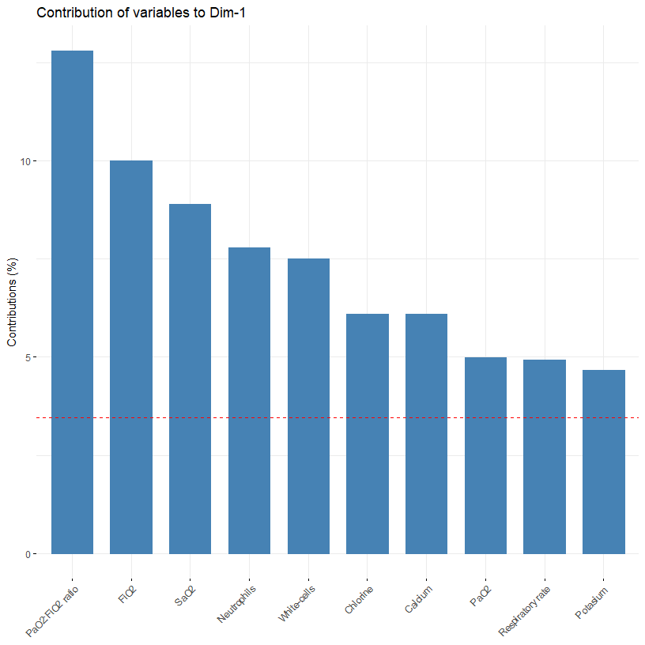

``` r
# Contribution plot of the top 10 variables on PC2
fviz_contrib(pca_data, choice = "var", axes = 2, top = 10)
```

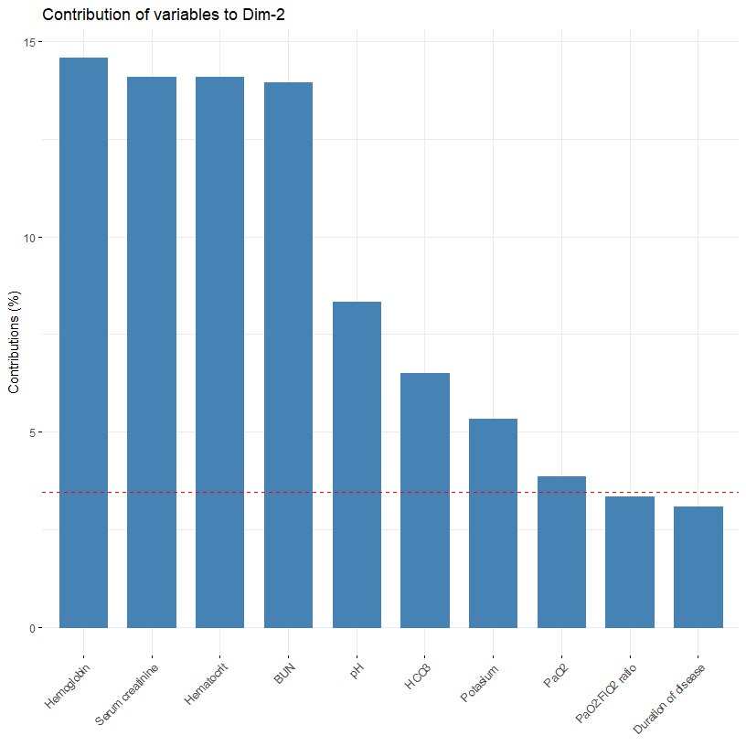

``` r
# Plot of 10 variables with the highest contribution on PC1 and PC2
d <- fviz_contrib(pca_data, choice = "var", axes = 1:2, top = 10)

# Plot of 10 variables with the highest contribution on PC3 and PC4
e <- fviz_contrib(pca_data, choice = "var", axes = 3:4, top = 10)

# Correlations circle and color by contributions values 
f <- fviz_pca_var(
  pca_data,
  col.var = "contrib",
  gradient.cols = c("#fee0d2", "#fc9272", "#de2d26"),
  repel = TRUE)
```

``` r
# Arrange multiple plots
ggpubr::ggarrange(a, d, b, e, c, f, ncol = 2, nrow = 3, 
                  labels = c("A)", "B)", "C)", "D)", "E)", "F)"), 
                  legend = "right")
```

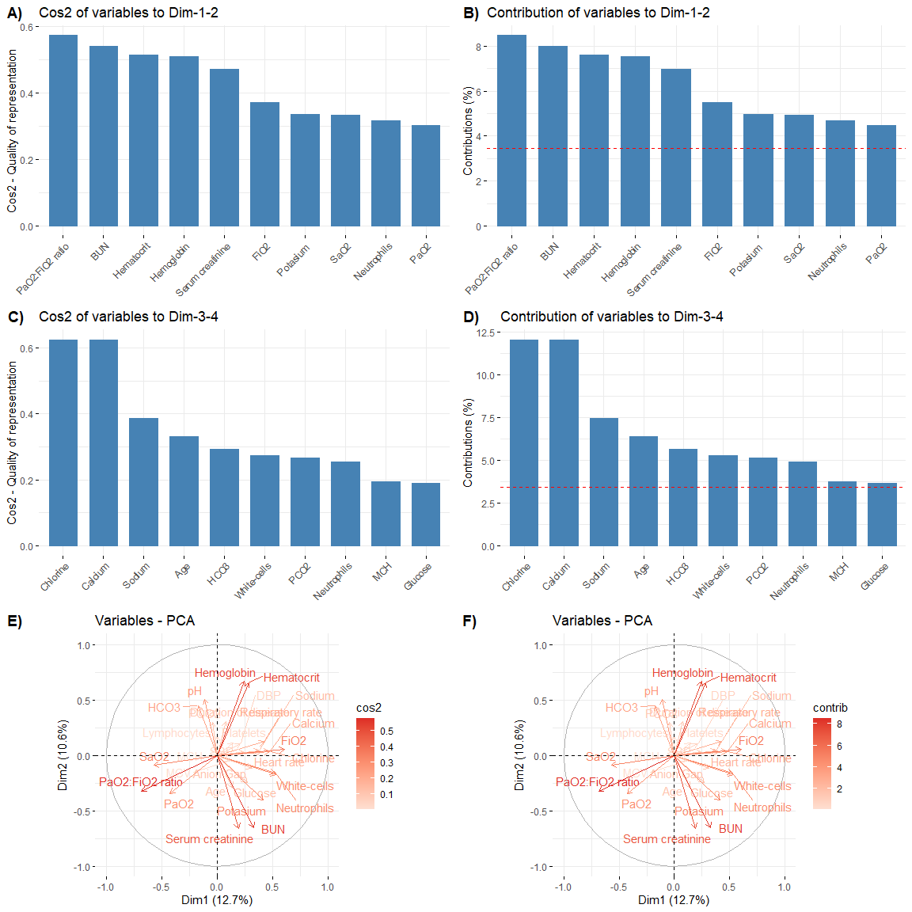

#### Individuals

``` r
# Extract results for the individuals
ind <- get_pca_ind(pca_data)

# Coordinates for the individuals
head(ind$coord, 5)

# Cos2 of the individuals on dimensions
head(ind$cos2, 5)

# Plot of 30 individuals with the highest cos2 on PC1 and PC2
a <- fviz_cos2(pca_data, choice = "ind", axes = 1:2, top = 30)

# Plot of 30 individuals with the highest cos2 on PC3 and PC4
b <- fviz_cos2(pca_data, choice = "ind", axes = 3:4, top = 30)

# Correlations circle and color by cos2 values 
c <- fviz_pca_ind(
  pca_data,
  col.ind = "cos2",
  gradient.cols = c("#fee0d2", "#fc9272", "#de2d26"),
  repel = TRUE)

# Contributions of the individuals on dimensions
head(ind$contrib, 5)

# Plot of 30 individuals with the highest contribution on PC1 and PC2
d <- fviz_contrib(pca_data, choice = "ind", axes = 1:2, top = 30)

# Plot of 30 individuals with the highest contribution on PC3 and PC4
e <- fviz_contrib(pca_data, choice = "ind", axes = 3:4, top = 30)

# Correlations circle and color by contributions values 
f <- fviz_pca_ind(
  pca_data,
  col.ind = "contrib",
  gradient.cols = c("#fee0d2", "#fc9272", "#de2d26"))
```

``` r
# Arrange multiple plots
ggpubr::ggarrange(a, d, b, e, c, f, ncol = 2, nrow = 3, 
                  labels = c("A)", "B)", "C)", "D)", "E)", "F)"), 
                  legend = "right")
```

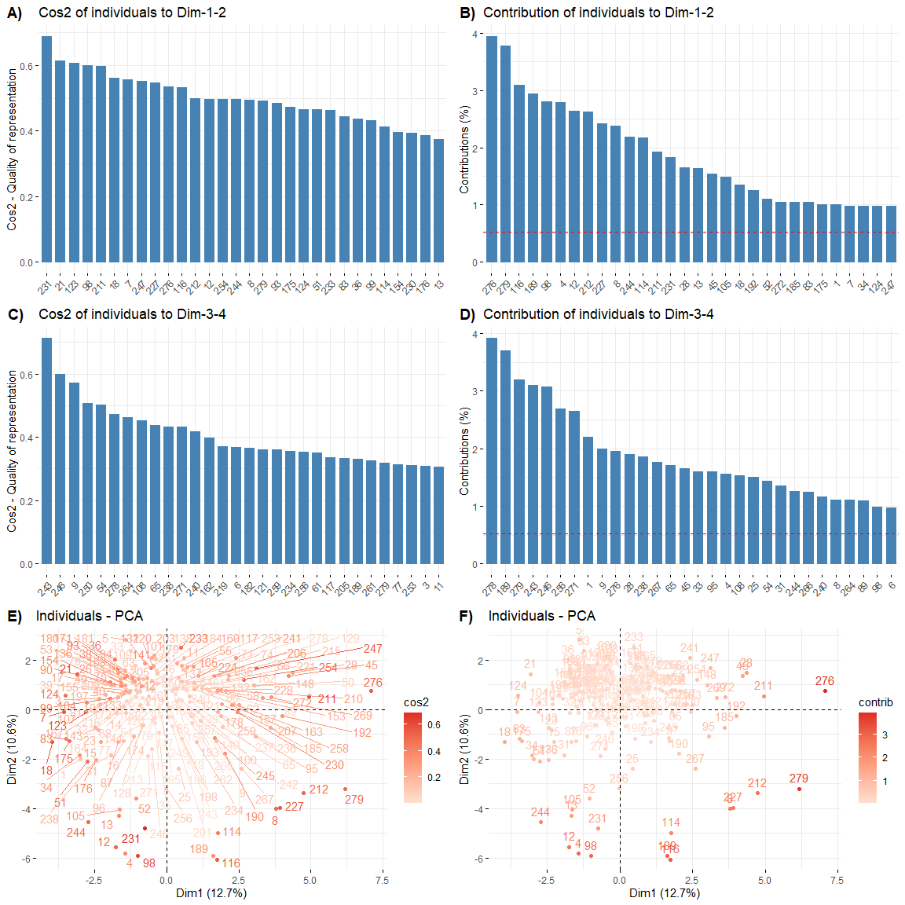

``` r
# Plot of individuals and color by outcome on PC1 and PC2
ind.graph <- fviz_pca_ind(
  pca_data,
  axes = 1:2,
  geom.ind = "point",
  col.ind = numerical$a_f,
  palette = "igv",
  addEllipses = TRUE,
  mean.point = FALSE,
  ggtheme = theme_pubr())

a <- ggpubr::ggpar(
  ind.graph,
  title = element_blank(),
  xlab = "PC1 (12.7%)",
  ylab = "PC2 (10.6%)",
  legend.title = "Group",
  legend = "right",
  font.legend = c(12, "black"))

# Plot of individuals and color by outcome on PC3 and PC4
ind.graph <- fviz_pca_ind(
  pca_data,
  axes = 3:4,
  geom.ind = "point",
  col.ind = numerical$a_f,
  palette = "igv",
  addEllipses = TRUE,
  mean.point = FALSE,
  ggtheme = theme_pubr())

b <- ggpubr::ggpar(
  ind.graph,
  title = element_blank(),
  xlab = "PC3 (9.2%)",
  ylab = "PC2 (8.6%)",
  legend.title = "Group",
  legend = "right",
  font.legend = c(12, "black"))
```

``` r
# Arrange multiple plots
ggpubr::ggarrange(a, b, ncol = 2, nrow = 1, labels = c("A)", "B)"), 
                  legend = "bottom", common.legend = TRUE)
```

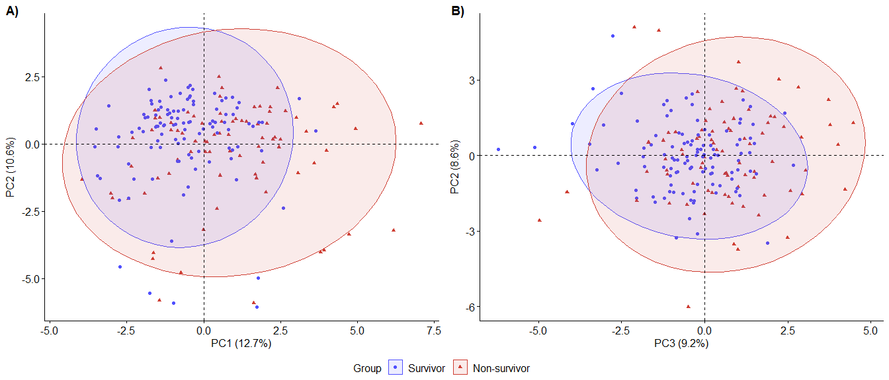

#### Biplot of individuals and variables

``` r
# Contributions on PC1 and PC2
a <- fviz_pca_biplot(
  pca_data,
  # Dimensions 1 and 2
  axes = 1:2,
  # Individuals
  col.ind = numerical$a_f,
  geom.ind = "point",
  col.var = "black",
  # Top 10 contributing variables
  geom.var = "text",
  select.var = list(contrib = 10),
  # Theme
  palette = "Set1",
  addEllipses = TRUE,
  mean.point = FALSE,
  repel = TRUE,
  ggtheme = theme_pubr())

# Plot parameters
a1 <- ggpubr::ggpar(
  a,
  title = element_blank(),
  xlab = "PC1 (12.7%)",
  ylab = "PC2 (10.6%)",
  legend.title = "Group",
  font.legend = c(12, "black"))

# Contributions on PC3 and PC4
b <- fviz_pca_biplot(
  pca_data,
  # Dimensions 3 and 4
  axes = 3:4,
  # Individuals
  col.ind = numerical$a_f,
  geom.ind = "point",
  col.var = "black",
  # Top 10 contributing variables
  geom.var = "text",
  select.var = list(contrib = 10),
  # Theme
  palette = "Set1",
  addEllipses = TRUE,
  mean.point = FALSE,
  repel = TRUE,
  ggtheme = theme_pubr())

# Plot parameters
b1 <- ggpubr::ggpar(
  b,
  title = element_blank(),
  xlab = "PC3 (9.2%)",
  ylab = "PC4 (8.6%)",
  legend.title = "Group",
  font.legend = c(12, "black"))

# Arrange multiple plots
F1 <- ggpubr::ggarrange(a1, b1, ncol = 2, nrow = 1, labels = c("A)", "B)"), 
                        legend = "bottom", common.legend = TRUE)

# View
F1
```

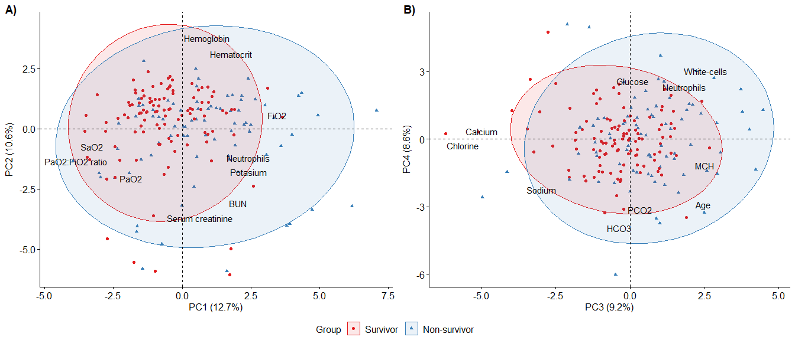

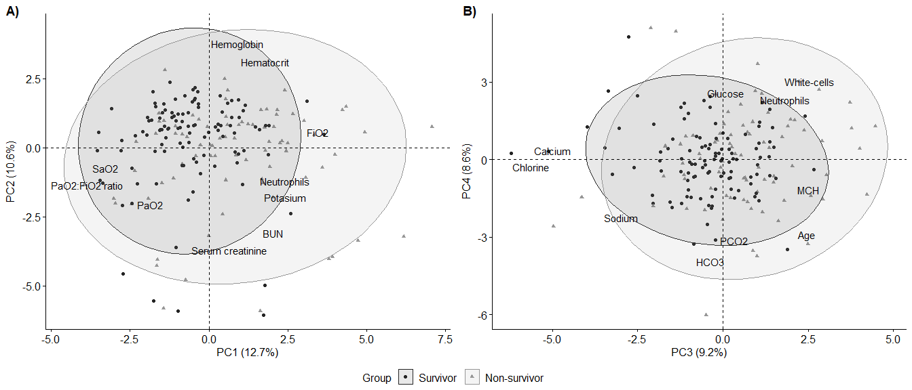

<div style="text-align: justify">

The PCA has limitations, including **sensitivity to the scale of
variables**. It’s essential to standardize variables to have *unit
variance* before conducting PCA to mitigate this issue. PCA also assumes
**linearity**; if variables do not exhibit linear relationships,
alternative dimensionality reduction methods like t-SNE or UMAP may be
more suitable for non-linear data structures. The principal components
(new dimensions) created by PCA are linear combinations of the original
variables (original dimensions) and may lack direct interpretability,
necessitating careful evaluation. Dimension reduction through PCA
inevitably leads to some information loss. While the discarded
components are less significant, they may still hold valuable insights.
Recognizing these limitations is crucial as it does not lessen PCA’s
value but rather enhances its usefulness in guiding its application.

</div>

### t-Distributed Stochastic Neighbor Embedding (t-SNE)

``` r
tsne_numerical <- data |>
  dplyr::select(where(is.numeric), -t_de_enfermedad, a_f) |>
  na.omit() |>
  mutate(ID = row_number())

meta_numerical <- tsne_numerical |>
  dplyr::select(ID, a_f)

tSNE_fit <- tsne_numerical |>
  dplyr::select(where(is.numeric)) |>
  scale() |>
  Rtsne()

tSNE_df <- tSNE_fit$Y %>%
  as.data.frame() %>%
  rename(tSNE1 = "V1",
         tSNE2 = "V2") %>%
  mutate(ID = row_number())

tSNE_df <- tSNE_df |>
  inner_join(meta_numerical, by = "ID")

tSNE_df |>
  ggplot(aes(x = tSNE1,
             y = tSNE2,
             color = a_f)) +
  geom_point() +
  scale_color_igv() +
  labs(color = "Group") +
  theme_minimal() +
  theme(legend.position = "right",
        axis.line = element_line(color = "black"))
```

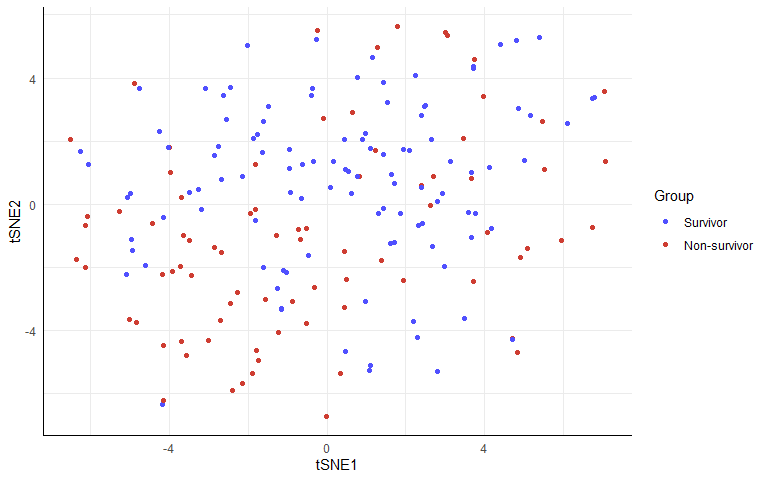

<div style="text-align: justify">

It’s recommended to perform PCA before K-means clustering because speeds
up the clustering process and optimizes computational resources,
especially on large datasets. The PCA optimizes clustering by reducing
noise and redundant information, which helps K-means clustering focus on
relevant features, leading to more accurate cluster assignments.
Dimension reduction captures important information into few dimensions,
this reduces the number of features and preserves most of the variation,
making subsequent clustering more efficient and improves interpretation.

</div>

# Save outputs

All distances are in inches

``` r
sect_properties <- prop_section(
  type = "continuous",
  page_margins = page_mar(bottom = 1, top = 1, right = 1, left = 1))
```

## Tables

``` r
# Save tables
save_as_docx(
  flex_table_1,
  path = stringr::str_glue(outputs_dir, "Table_1.docx"),
  align = "center")

save_as_docx(
  flex_table_2,
  path = stringr::str_glue(outputs_dir, "Table_2.docx"),
  align = "center")

save_as_docx(
  flex_table_3,
  path = stringr::str_glue(outputs_dir, "Table_3.docx"),
  align = "center")
```

## Figures

``` r
# Save supplementary figure 1 (EPS)
ggsave(
  plot = FS1,
  filename = stringr::str_glue(outputs_dir, "FIG_S1.eps"),
  width = 12,
  height = 12,
  units = "in")

# Save supplementary figure 1 (PNG)
ggsave(
  plot = FS1,
  filename = stringr::str_glue(outputs_dir, "FIG_S1.png"),
  width = 12,
  height = 12,
  dpi = 300,
  units = "in")

# Save supplementary figure 1 (JPEG)
ggsave(
  plot = FS1,
  filename = stringr::str_glue(outputs_dir, "FIG_S1.jpeg"),
  width = 12,
  height = 12,
  dpi = 300,
  units = "in")

# Save supplementary figure 1 grey (JPEG)
ggsave(
  plot = FS1_grey,
  filename = stringr::str_glue(outputs_dir, "FIG_S1_grey.jpeg"),
  width = 12,
  height = 12,
  dpi = 500,
  units = "in")

# Save figure 2 (EPS)
ggsave(
  plot = F1,
  filename = stringr::str_glue(outputs_dir, "FIG2.eps"),
  width = 14,
  height = 6,
  units = "in")

# Save figure 2 (PNG)
ggsave(
  plot = F1,
  filename = stringr::str_glue(outputs_dir, "FIG2.png"),
  width = 14,
  height = 6,
  dpi = 300,
  units = "in")

# Save figure 2 (JPEG)
ggsave(
  plot = F1,
  filename = stringr::str_glue(outputs_dir, "FIG2.jpeg"),
  width = 14,
  height = 6,
  dpi = 300,
  units = "in")

# Save figure 2 grey (JPEG)
ggsave(
  plot = F1_grey,
  filename = stringr::str_glue(outputs_dir, "FIG2_grey.jpeg"),
  width = 14,
  height = 6,
  dpi = 500,
  units = "in")
```
